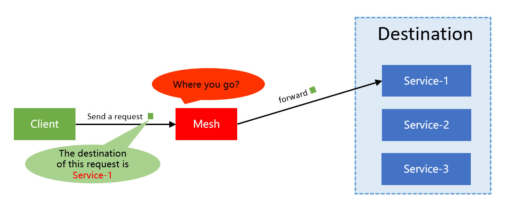
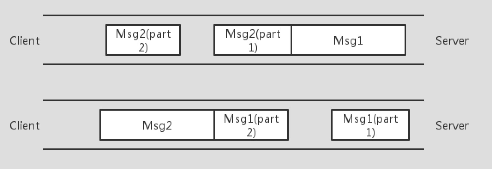
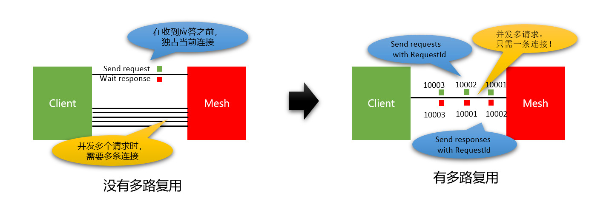
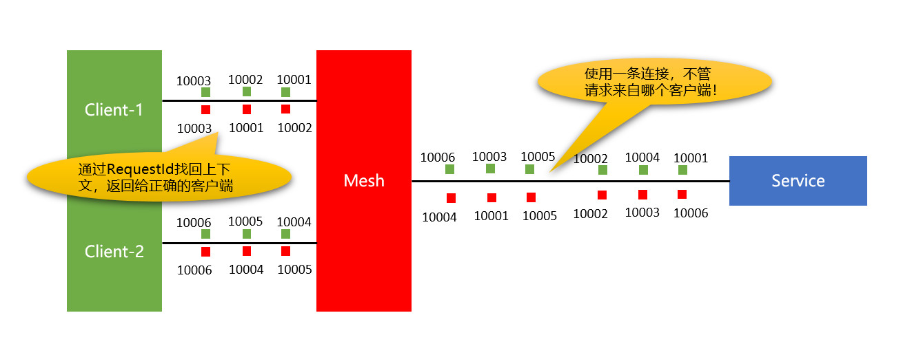

+++
title = "SOFAMesh中的多协议通用解决方案x-protocol介绍系列(2)-快速解码转发"
subtitle = ""
summary = "虽然大多数的服务都不会要求极致性能，但是系统中总是有可能出现个别服务的确对性能要求很高，为了满足这些特例而不至于因此整体否决Servicemesh方案，我们需要在Servicemesh的大框架下提供一个折中方案。"
date = 2018-09-19
draft = false

tags = ["x-protocol", "SOFAMesh"]
categories = []
#projects = ["sofamesh"]

[header]
image = "headers/post/201809-xprotocol-rapid-decode-forward.jpg"
caption = ""
+++

## 背景介绍

在Istio和Envoy中，对通讯协议的支持，主要体现在HTTP/1.1和HTTP/2上，而我们SOFAMesh，则需要支持以下几个RPC协议：

- SOFARPC：这是蚂蚁金服大量使用的RPC协议(已开源)
- HSF RPC：这是阿里集团内部大量使用的RPC协议(未开源)
- Dubbo RPC: 这是社区广泛使用的RPC协议(已开源)

### 更适合的平衡点：性能和功能

对于服务间通讯解决方案，性能永远是一个值得关注的点。而SOFAMesh在项目启动时就明确要求在性能上要有更高的追求，为此，我们不得不在Istio标准实现之外寻求可以获取更高性能的方式，比如支持各种RPC协议。

期间有两个发现：

1. Istio在处理所有的请求转发如REST/gRPC时，会解码整个请求的header信息，拿到各种数据，提取为Attribute，然后以此为基础，提供各种丰富的功能，典型如**Content Based Routing**。
2. 而在测试中，我们发现：解码请求协议的header部分，对CPU消耗较大，直接影响性能。

因此，我们有了一个很简单的想法：是不是可以在转发时，不开启部分功能，以此换取转发过程中的更少更快的解码消耗？毕竟，不是每个服务都需要用到**Content Based Routing**这样的高级特性，大部分服务只使用 **Version Based Routing**，尤其是使用RPC通讯协议的服务，没有HTTP那么表现力丰富的header，对Content Based Routing的需求要低很多。

此外，对于部分对性能有极高追求的服务，不开启高级特性而换取更高的性能，也是一种满足性能要求的折中方案。考虑到系统中总存在个别服务对性能非常敏感，我们觉得ServiceMesh提供一种性能可以接近直连的方案会是一个有益的补充。为了满足这些特例而不至于因此整体否决Servicemesh方案，我们需要在Servicemesh的大框架下提供一个折中方案。

## 请求转发

在我们进一步深入前，我们先来探讨一下实现请求转发的技术细节。

有一个关键问题：当Envoy/MOSN这样的代理程序，接收到来自客户端的TCP请求时，需要获得哪些信息，才可以正确的转发请求到上游的服务器端？

### 最关键的信息：destination

首先，毫无疑问的，必须拿到destination/目的地，也就是客户端请求必须通过某种方式明确的告之代理该请求的destination，这样代理程序才能根据这个destionation去找到正确的目标服务器，然后才有后续的连接目标服务器和转发请求等操作。

Destination信息的表述形式可能有：

1. IP地址

	可能是服务器端实例实际工作的IP地址和端口，也可能是某种转发机制，如Nginx/HAProxy等反向代理的地址，或者k8s中的ClusterIP。

	举例："192.168.1.1:8080"是实际IP地址和端口，"10.2.0.100:80"是ngxin反向代理地址，"172.168.1.105:80"是k8s的ClusterIP。

2. 目标服务的标识符

	可用于名字查找，如服务名，可能带有各种前缀后缀。然后通过名字查找/服务发现等方式，得到地址列表（通常是IP地址+端口形式）。

	举例："userservice"是标准服务名， "com.alipay/userservice"是加了域名前缀的服务名， "service.default.svc.cluster.local"是k8s下完整的全限定名。

Destination信息在请求报文中的携带方式有：

1. 通过通讯协议传递

	这是最常见的形式，标准做法是通过header头，典型如HTTP/1.1下一般使用 host header，举例如"Host: userservice"。HTTP/2下，类似的使用":authority" header。

	对于非HTTP协议，通常也会有类似的设计，通过协议中某些字段来承载目标地址信息，只是不同协议中这个字段的名字各有不同。如SOFARPC，HSF等。

	有些通讯协议，可能会将这个信息存放在payload中，比如后面我们会介绍到的dubbo协议，导致需要反序列化payload之后才能拿到这个重要信息。

2. 通过TCP协议传递

	这是一种非常特殊的方式，通过在TCP option传递，上一节中我们介绍Istio DNS寻址时已经详细介绍过了。

### TCP拆包

如何从请求的通讯协议中获取destination？这涉及到具体通讯协议的解码，其中第一个要解决的问题就是如何在连续的TCP报文中将每个请求内容拆分开，这里就涉及到经典的TCP沾包、拆包问题。

转发请求时，由于涉及到负载均衡，我们需要将请求发送给多个服务器端实例。因此，有一个非常明确的要求：就是必须以单个请求为单位进行转发。即单个请求必须完整的转发给某台服务器端实例，负载均衡需要以请求为单位，不能将一个请求的多个报文包分别转发到不同的服务器端实例。所以，拆包是请求转发的必备基础。

由于篇幅和主题限制，我们不在这里展开TCP沾包、拆包的原理。后面针对每个具体的通讯协议进行分析时再具体看各个协议的解决方案。

### 多路复用的关键参数：RequestId

RequestId用来关联request和对应的response，请求报文中携带一个唯一的id值，应答报文中原值返回，以便在处理response时可以找到对应的request。当然在不同协议中，这个参数的名字可能不同（如streamid等）。

严格说，RequestId对于请求转发是可选的，也有很多通讯协议不提供支持，比如经典的HTTP1.1就没有支持。但是如果有这个参数，则可以实现多路复用，从而可以大幅度提高TCP连接的使用效率，避免出现大量连接。稍微新一点的通讯协议，基本都会原生支持这个特性，比如SOFARPC，Dubbo，HSF，还有HTTP/2就直接內建了多路复用的支持。

HTTP/1.1不支持多路复用(http1.1有提过支持幂等方法的pipeline机制但是未能普及)，用的是经典的ping-pong模式：在请求发送之后，必须独占当前连接，等待服务器端给出这个请求的应答，然后才能释放连接。因此HTTP/1.1下，并发多个请求就必须采用多连接，为了提升性能通常会使用长连接+连接池的设计。而如果有了requestid和多路复用的支持，客户端和Mesh之间理论上就可以只用一条连接(实践中可能会选择建立多条)来支持并发请求：

而Mesh与服务器（也可能是对端的Mesh）之间，也同样可以受益于多路复用技术，来自不同客户端而去往同一个目的地的请求可以混杂在同一条连接上发送。通过RequestId的关联，Mesh可以正确将reponse发送到请求来自的客户端。

由于篇幅和主题限制，我们不在这里展开多路复用的原理。后面针对每个具体的通讯协议进行分析时再具体看各个协议的支持情况。

### 请求转发参数总结

上面的分析中，我们可以总结到，对于Sidecar，要正确转发请求：

1. 必须获取到destination信息，得到转发的目的地，才能进行服务发现类的寻址
2. 必须要能够正确的拆包，然后以请求为单位进行转发，这是负载均衡的基础
3. 可选的RequestId，这是开启多路复用的基础

因此，这里我们的第一个优化思路就出来了：**尽量只解码获取这三个信息**，满足转发的基本要求。其他信息如果有性能开销则跳过解码，所谓"快速解码转发"。基本原理就是牺牲信息完整性追求性能最大化。

而结合上一节中我们引入的DNS通用寻址方案，我们是可以从请求的TCP options中得到ClusterIP，从而实现寻址。这个方式可以实现不解码请求报文，尤其是header部分解码destination信息开销大时。这是我们的第二个优化思路：**跳过解码destination信息**，直接通过ClusterIP进行寻址。

具体的实现则需要结合特定通讯协议的实际情况进行。

## 主流通讯协议

现在我们开始，以Proxy、Sidecar、Service Mesh的角度来看看目前主流的通讯协议和我们前面列举的需要在SOFAMesh中支持的几个协议。

### SOFARPC/bolt协议

SOFARPC 是一款基于 Java 实现的 RPC 服务框架，详细资料可以查阅 [官方文档](http://www.sofastack.tech/sofa-rpc/docs/Home)。SOFARPC 支持 [bolt](https://github.com/alipay/sofa-bolt)，rest，dubbo 协议进行通信。REST、dubbo后面单独展开，这里我们关注bolt协议。

bolt 是蚂蚁金融服务集团开放的基于 Netty 开发的网络通信框架，其协议格式是变长，即协议头+payload。具体格式定义如下，以request为例（response类似）：

我们只关注和请求转发直接相关的字段：

- TCP拆包

	botl协议是定长+变长的复合结构，前面22个字节长度固定，每个字节和协议字段的对应如图所示。其中classLen，headerLen和contentLen三个字段指出后面三个变长字段className，header，content的实际长度。和通常的变长方案相比只是变长字段有三个。拆包时思路简单明了：

	1. 先读取前22个字节，解出各个协议字段的实际值，包括classLen，headerLen和contentLen
	2. 按照classLen，headerLen和contentLen的大小，继续读取className，header，content

- Destination

	Bolt协议中的header字段是一个map，其中有一个key为"service"的字段，传递的是接口名/服务名。读取稍微麻烦一点点，需要先解码整个header字段，这里对性能有影响。

- RequestId

	Blot协议固定字段中的`requestID`字段，可以直接读取。

SOFARPC中的bolt协议，设计的比较符合请求转发的需要，TCP拆包，读取RequestID，都没有性能问题。只是Destination的获取需要解码整个header，性能开销稍大。

总结：适合配合DNS通用解码方案，跳过对整个header部分的解码，从而提升性能。当然由于这个header本身也不算大，优化的空间有限，具体提升需要等对比测试的结果出来。

### HSF协议

HSF协议是经过精心设计工作在4层的私有协议，由于该协议没有开源，因此不便直接暴露具体格式和字段详细定义。

不过基本的设计和bolt非常类似：

- 采用变长格式，即协议头+payload
- 在协议头中可以直接拿到服务接口名和服务方法名作为Destination
- 有RequestID字段

基本和bolt一致，考虑到Destination可以直接读取，比bolt还要方便一些，HSF协议可以说是对请求转发最完美的协议。

总结：目前的实现方案也只解码了这三个关键字段，速度足够快，不需要继续优化。

### Dubbo协议

Dubbo协议也是类似的协议头+payload的变长结构，其协议格式如下：

其中long类型的`id`字段用来把请求request和返回的response对应上，即我们所说的`RequestId`。

这样TCP拆包和多路复用都轻松实现，稍微麻烦一点的是：Destination在哪里？Dubbo在这里的设计有点不够理想，在协议头中没有字段可以直接读取到Destination，需要去读取data字段，也就是payload，里面的path字段通常用来保存服务名或者接口名。method字段用来表示方法名。

从设计上看，path字段和method字段被存放在payload中有些美中不足。庆幸的是，读取这两个字段的时候不需要完整的解开整个payload，好险，不然，那性能会没法接受的。

以hession2为例，data字段的组合是：dubbo version + path + interface version + method + ParameterTypes + Arguments + Attachments。每个字段都是一个byte的长度+字段值的UTF bytes。因此读取时并不复杂，速度也足够快。

基本和HSF一致，就是Destination的读取稍微麻烦一点，放在payload中的设计让人吓了一跳，好在有惊无险。整体说还是很适合转发的。

总结：同HSF，不需要继续优化。

### HTTP/1.1

HTTP/1.1的格式应该大家都熟悉，而在这里，不得不指出，HTTP/1.1协议对请求转发是非常不友好的（甚至可以说是恶劣！）：

1. HTTP请求在拆包时，需要先按照HTTP header的格式，一行一行读取，直到出现空行表示header结束
2. 然后必须将整个header的内容全部解析出来，才能取出`Content-Length header`
3. 通过`Content-Length` 值，才能完成对body内容的读取，实现正确拆包
4. 如果是chunked方式，则更复杂一些
5. Destination通常从`Host` header中获取
6. 没有RequestId，完全无法实现多路复用

这意味着，为了完成最基本的TCP拆包，必须完整的解析全部的HTTP header信息，没有任何可以优化的空间。对比上面几个RPC协议，轻松自如的快速获取几个关键信息，HTTP无疑要重很多。这也造成了在ServiceMesh下，HTTP/1.1和REST协议的性能总是和其他RPC方案存在巨大差异。

对于注定要解码整个header部分，完全没有优化空间可言的HTTP/1.1协议来说，Content Based Routing 的解码开销是必须付出的，无论是否使用 Content Based Routing 。因此，快速解码的构想，对HTTP/1.1无效。

总结：受HTTP/1.1协议格式限制，上述两个优化思路都无法操作。

### HTTP/2和gRPC

作为HTTP/1.1的接班人，HTTP/2则表现的要好很多。

> 备注：当然HTTP/2的协议格式复杂多了，由于篇幅和主题的限制，这里不详细介绍HTTP/2的格式。

首先HTTP/2是以帧的方式组织报文的，所有的帧都是变长，固定的9个字节+可变的payload，Length字段指定payload的大小：

HTTP2的请求和应答，也被称为Message，是由多个帧构成，在去除控制帧之外，Message通常由Header帧开始，后面接CONTINUATION帧和Data帧（也可能没有，如GET请求）。每个帧都可以通过头部的Flags字段来设置END_STREAM标志，表示请求或者应答的结束。即TCP拆包的问题在HTTP/2下是有非常标准而统一的方式完成，完全和HTTP/2上承载的协议无关。

HTTP/2通过Stream內建多路复用，这里的`Stream Identifier` 扮演了类似前面的`RequestId`的角色。

而Destination信息则通过Header帧中的伪header `:authority` 来传递，类似HTTP/1.1中的`Host` header。不过HTTP/2下header会进行压缩，读取时稍微复杂一点，也存在需要解压缩整个header帧的性能开销。考虑到拆包和获取RequestId都不需要解包（只需读取协议头，即HTTP/2帧的固定字段），速度足够快，因此存在很大的优化空间：不解码header帧，直接通过DNS通用寻址方案，这样性能开销大为减少，有望获得极高的转发速度。

总结：HTTP/2的帧设计，在请求转发时表现的非常友好。唯独Destination信息放在header中，会造成必须解码header帧。好在DNS通用寻址方案可以弥补，实现快速解码和转发。

## Servicemesh时代的RPC理想方案

在文章的最后，我们总结并探讨一下，对于Servicemesh而言，什么样的RPC方案是最理想的？

1. 必须可以方便做TCP拆包，最好在协议头中就简单搞定，标准方式如固定协议头+length字段+可变payload。HSF协议, bolt协议和dubbo协议表现完美，HTTP/2采用帧的方式，配合END_STREAM标志，方式独特但有效。HTTP/1.1则是反面典型。
2. 必须可以方便的获取destination字段，同样最好在协议头中就简单搞定。HSF协议表现完美，dubbo协议藏payload中但终究还是可以快速解码有惊无险的过关，bolt协议和HTTP/2协议就很遗憾必须解码header才能拿到，好在DNS通用寻址方案可以弥补，但终究丢失了服务名和方法名信息。HTTP/1.1依然是反面典型。
3. 最好有RequestId字段，同样最好在协议头中就简单搞定。这方面HSF协议，dubbo协议，bolt协议表现完美，HTTP/2协议更是直接內建支持。HTTP/1.1继续反面典型。

因此，仅以方便用最佳性能进行转发，对ServiceMesh、sidecar友好而言，最理想的RPC方案是：

- 传统的变长协议

	固定协议头+length字段+可变payload，然后在固定协议头中直接提供RequestId和destination。

- 基于帧的协议

	以HTTP/2为基础，除了请求结束的标志位和RequestId外，还需要通过帧的固定字段来提供destination信息。

或许，在未来，在Servicemesh普及之后，对Servicemesh友好成为RPC协议的特别优化方向，我们会看到表现完美更适合Servicemesh时代的新型RPC方案。

