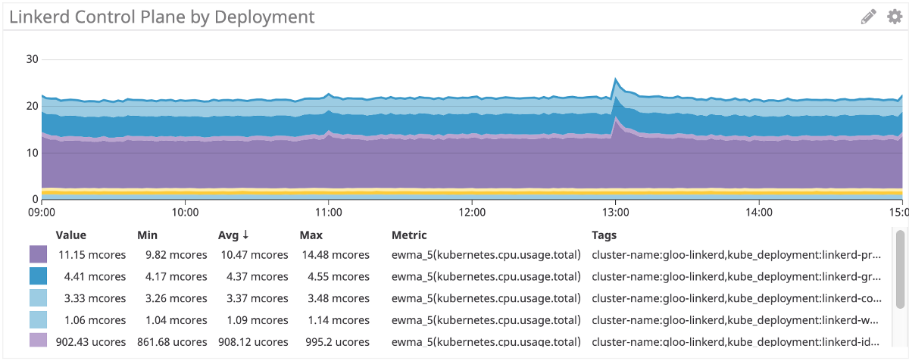
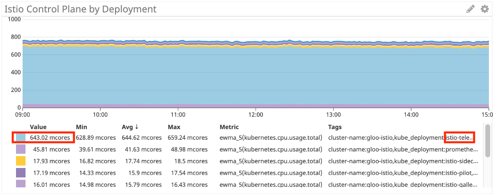

+++
title = "Istio深度解读之Mixer篇: 浪子回头金不换"

date = 2019-04-28
lastmod = 2019-04-28
draft = true

tags = ["服务网格","Istio", "Mixer"]
summary = "Istio深度解读之Mixer篇: 浪子回头金不换"
abstract = "Istio深度解读之Mixer篇: 浪子回头金不换"

[header]
image = "headers/post/201904-microservice-anti-patten.jpg"
caption = ""

+++

## 前言

近期 Twitter 上 Service Mesh 圈子里面有一个事情刷屏了，事情的起源是 Shopify公司 的 [Michael Kipper](https://twitter.com/michaelkipper) 同学在对 Istio 和 Linkerd2 对比评测之后发表了一篇文章：[Benchmarking Istio & Linkerd CPU](https://medium.com/@michael_87395/benchmarking-istio-linkerd-cpu-c36287e32781) 。

> 备注：原文在 medium.com 上发表，可能不能直接访问。我前两天写了一篇文章来介绍这个事情，并做了一个简单的分析，不能直接访问上面链接的同学可以通过我的文章来了解情况：[Istio性能问题讨论](../201904-istio-performance-issue/)。

我们直接搬运结果，控制平面上 Istio 和 Linkerd2 的性能表现是这样的：

Linkerd2 控制平面的CPU消耗，大概22 mcore。

Istio 控制平面的CPU消耗，约 750 mcore，大约是 linkerd2 的 **35** 倍 （是的，你没有看错，不是多35%，也不是3.5倍）。而且从图片上的数据看，istio-telemetry 使用 643 mcore，占比高达 85% (643 / 750)，也就是说 Istio 整个系统中绝大部分的CPU消耗在Mixer，而不是一般直觉中的 Sidecar （Envoy）。

而且，请注意：图中只有 istio-telemetry ，没有 istio-policy，也就是说这可能还是关闭了 mixer check 只开启了 mixer report 功能的结果，如果开启 mixer check 功能估计 istio-policy 模块的CPU消耗也会不低。

从这个角度说，Mixer 目前已经成为 Istio 体系中最大的性能瓶颈，拖累整个 Istio 的性能表现。甚至连 Istio 官方都给出了一个不是办法的办法：关闭 Mixer check 功能。关注 Istio 的同学，会发现在最新的 Istio 1.1 版本中，Mixer check 的功能已经默认关闭。

**为什么Mixer 的性能表现会如此糟糕？**

本文将全面剖析Mixer的架构和设计，解答这个问题。

## Mixer原始设计

### Istio架构

下图是 Istio 早期的架构图：

这个架构从2017年Istio 0.1版本基本沿用至今，和目前最新的 Istio 1.1 版本相比，差别也就只有增加了 Galley 模块，和 Istio-Auth改名为 Citadel。

Istio的最基本架构设计原则是：

- Envoy 组成数据平面，负责处理请求流量，完成服务通信
- Pilot / Mixer / Auth（现在改名叫做 Citadel）组成控制平面，用来为数据平面提供信息，并控制数据平面的行为

### 部署模型一刀切

从概念抽象和架构设计的高度看，Istio将系统分为数据平面和控制平面的想法非常自然而正确，其中 Pilot / Mixer / Citadel 的分工也没问题。

但是在代码实现和组件部署时，Istio继续采取了数据平面和控制平面简单分离的方式，就有形而上学的味道：

在数据平面和控制平面分离的基本设计原则指导下，Istio

从图上可以看到：

- Mixer 是作为控制平面的一部分，以独立进程运行
- Mixer 需要和运行在数据平面的 Envoy 通信

控制平面和数据平面的通信理所当然的是通过远程网络访问来完成，Istio 中实际统一使用 gRPC 协议。因此在图上可以看到，控制平面的三个模块 Pilot / Mixer / Auth（现在改名叫做 Citadel）都和数据平面的 Envoy 有交互，或者说远程通信。

但如果细细分析这三个模块和数据平面/Envoy 的交互方式和内容，就会发现 Mixer 的特殊之处：

1. 数据交互的方向

  - Pilot 和 Citadel 都是下发数据和信息，即数据的方向是从控制平面到数据平面
  - Mixer 相反，是从数据平面向控制平面发起请求（check）或者上报信息（report）
2. 数据内容的语义

  - Pilot 和 Citadel 下发的都是控制信息，如xDS中的服务发现信息、各种路由规则、证书，非常符合控制平面语义
  - Mixer 中 check 的功能是控制语义，如黑白名单/策略控制等，但是 report 功能纯粹是数据上报和收集，完全不涉及任何的控制语义
3. 和数据平面请求流量的关系

  - Citadel 主要是证书类的信息，通常在启动和请求连接建立时有通信，和数据平面的每个请求没有直接关系，流量开始之后基本就不再发生交互
  - Pilot 主要下发的是xDS信息，同样是开始时发送，后面只有发生变更了才更新，同样是和数据平面的每个请求没有直接关系
  - Mixer check 是每个数据平面的请求都要访问一次（有缓存优化），Mixer Report 是需要上报每个请求的数据（有异步 + 批量+ 采样的优化），原则上说 Mixer 和数据平面的每个请求都有直接关系 
4. 最特殊的是，mixer check的逻辑从业务逻辑语义上，必须是每请求 + 同步阻塞模式，对数据平面的影响极大

## Mixer新版设计

## Mixer V2规划

## 总结

