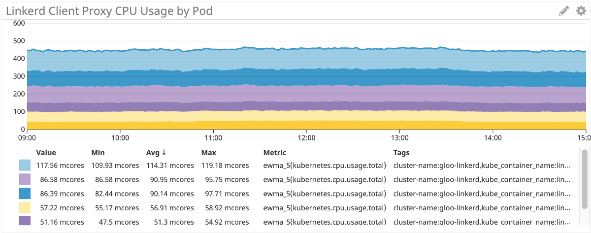
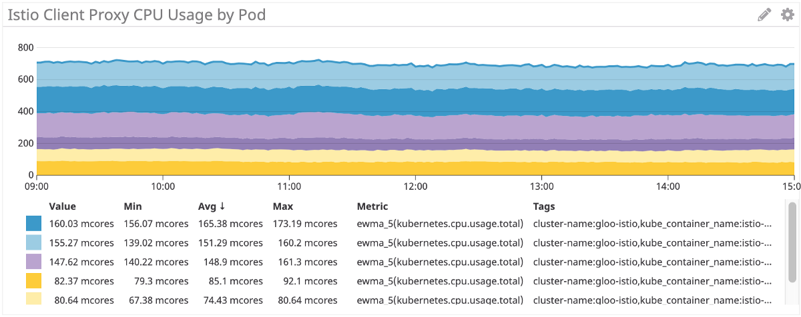
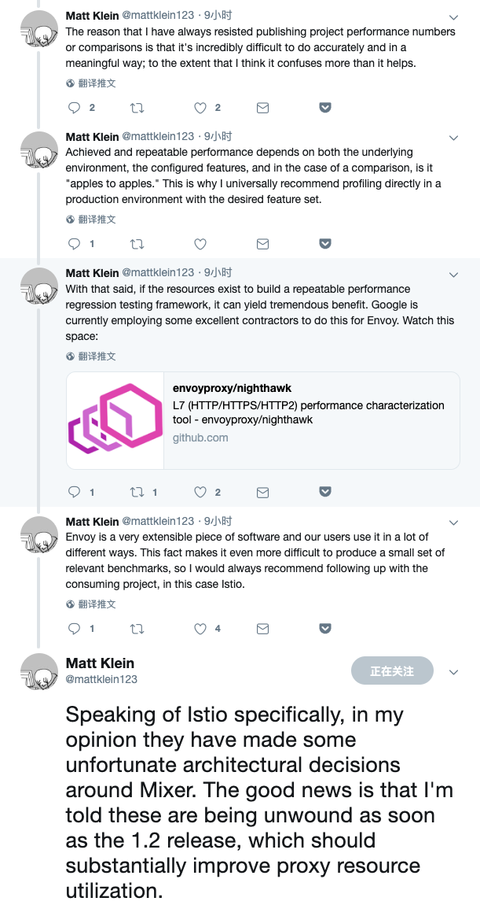

+++
title = "Istio性能问题讨论"

date = 2019-04-23
lastmod = 2019-04-23
draft = false

tags = ["Istio"]
summary = "来自 Shopify 的 Michael Kipper 发表了一篇文章，评测和对比了 Istio 和 Linkerd2 的CPU使用情况。Istio 的表现可以说相当的尴尬…..."
abstract = "来自 Shopify 的 Michael Kipper 发表了一篇文章，评测和对比了 Istio 和 Linkerd2 的CPU使用情况。Istio 的表现可以说相当的尴尬…..."

[header]
image = "headers/post/201903-istio-service-visibility.jpg"
caption = ""

+++

## 背景

今天，来自 Shopify 的 [Michael Kipper](https://twitter.com/michaelkipper) 发表了一篇文章：

[Benchmarking Istio & Linkerd CPU](https://medium.com/@michael_87395/benchmarking-istio-linkerd-cpu-c36287e32781)

Shopify 在部署Istio作为他们的服务网格解决方案，但是遇到问题（hitting a wall：撞墙）：cost/成本！

作者自己做了一次对比测试，详细的测试情况请见原文。我们这里直奔结果，看 Istio 和 Linkerd2 的对比。

## 测试结果

### 控制平面

Linkerd2 的控制平面，大概22 mcore。

Istio 的控制平面，约 750 mcore，大约是 linkerd2 的35倍。而且从图片上的数据看，istio-telemetry 使用 643 mcore，占比高达 85%。但即使去除 mixer（ istio-telemetry），istio 依然超过100 mcore，依然是 Linkerd2 的4到5倍。

### 数据平面

再看控制平面的表现，Istio 这边是基于c++的成熟稳重的 Envoy，Linkerd2 则是基于新型语言Rust全新开发。

Linkerd2 Proxy 的表现，这是客户端 Sidecar：

Istio/Envoy的表现（客户端 Sidecar）：

还有服务器端sidecar的使用对比，就不继续转了，简单说结果是Istio/Envoy的CPU使用比 Linkerd 多 60%。

总体来说，在数据平面，Istio/Envoy的CPU使用比 Linkerd 多 50%～60%。

### 测试结果总结

综上所述，Istio在控制平面的CPU消耗约是 Linkerd2 的35倍（开启Mixer）或者4倍（关闭Mixer），在数据平面的CPU消耗是 Linkerd2 的1.5倍。

这个消耗还是很明显的，尤其控制平面更是有些夸张。

## Twitter上的讨论

有兴趣的同学可以直接去看 twitter 上的讨论：https://twitter.com/michaelkipper

讨论中谈到说既然mixer消耗最大，可以关闭，如果你不需要。但是明显这个建议是不能被接受的：毕竟使用Istio的一个很主要的原因就是可观测行，简单粗暴的去掉mixer的telemetry功能是不可取的。

然后就是一个搞笑的地方，Karl 质疑说测试对比中 Linkerd2 是否提供了同样的可观测行，William Morgan（开发Linkerd2 的 Beoyant 公司的CEO）跳出来说 Yes！

后面 Envoy 的灵魂人物，Matt Klein接连发了几个twitter

最后这条值得注意：

> 具体到 Istio, 在我看来, 他们围绕 Mixer 做出了一些不幸(unfortunate)的架构决定。好消息是, 我被告知, 在1.2 发布后这些问题会被解除, 这应该会大大提高proxy资源的利用率。

看来是个好消息，问题是具体会有什么内容？Matt 没说，准备去调研一下，如有收获后续更新。注意这个用词，**不幸(unfortunate)**，Matt 用它来形容 Istio Mixer 设计，Mixer的设计问题可见一斑。

## Mixer背景补充

在这里补充一些Mixer的背景知识，关于Mixer的功能，可以分为两大块：

1. 策略/policy：或者叫做precondition，体现在api上的方法名是 check()，实现上是同步阻塞+每个请求都要执行，因此对性能影响极大，早早就被质疑，考虑到策略的必要性没那么强而性能消耗又实在过高，因此社区很多人选择关闭mixer的policy功能。后来Istio依从社区的声音，在Istio1.1版本之后默认将mixer的policy功能关闭，从而结束了社区没完没了的类似问题：为什么这么慢？怎么关闭policy？
2. 遥测/telemetry：包括metric/trace等，用于实现可观测行，体现在api上的方法名是 report()，这块也有一些质疑，不过好在report的实现是异步+批量，性能影响没check()那么夸张，而可观测性又太过重要，因此一直凑合在用。然后今天，被 Linkerd2 吊打。

有关 Mixer telemetry的实现，和mixer cache存在的问题，请见我去年的博客文章：

- [Mixer Cache: Istio的阿克琉斯之踵?](../201804-istio-achilles-heel/)
- [Istio Mixer Cache工作原理与源码分析](../201804-istio-mixer-cache-concepts/)

另外，为什么Linkerd2 的可观测性的实现性能可以高这么多？

这里涉及到Istio的架构设计，Istio的解决方案是 Sidecar 将各种请求信息发送给Mixer，由Mixer中的adapter进行各种处理，有很好的设计弹性和灵活度，但是付出了多一次 Sidecar 到Mxier的远程调用的开销。而 Linkerd2 的前身 Conduit，采用的方式是在 Sidecar 中直接完成处理，不走mixer远程访问。

有关这块的详细分析，请见我去年的演讲文章 [大规模微服务架构下的Service Mesh探索之路](../../talk/201806-service-mesh-explore/) 的 **架构设计** 一节。

## 尾声

Mixer中这两块的问题，去年就已经很明显。遗憾的是一年过去了，截止到Istio 1.1版本还是没有改变。希望Istio 1.2 中会有实质性的改善。

另外，从我们团队最近的遭遇看，Istio的性能问题，不仅仅在于Mixer，之前一直觉得不会有大问题的Pilot也是状况百出，有关这块，后续会撰文说明。