+++
title = "Google Cloud Run详细介绍"

date = 2019-05-10
lastmod = 2019-05-10
draft = false

tags = ["serverless", "Cloud Run"]
summary = "在Cloud Next 2019 大会上，Google 宣布了 Cloud Run，这是一个新的基于容器运行 Serverless 应用的解决方案。Cloud Run 基于开源的 knative 项目，宣称要将 serverless 带入容器世界。"
abstract = "在Cloud Next 2019 大会上，Google 宣布了 Cloud Run，这是一个新的基于容器运行 Serverless 应用的解决方案。Cloud Run 基于开源的 knative 项目，宣称要将 serverless 带入容器世界。"

[header]
image = "headers/post/project-google-cloud-run.jpg"
caption = ""

+++

## Cloud Run介绍

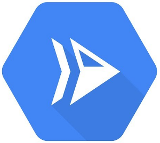

在旧金山举办的 Google Cloud Next 2019 大会上，Google 宣布了 Cloud Run，这是一个新的基于容器运行 Serverless 应用的解决方案。Cloud Run 基于开源的 knative 项目，是 knative 的 Google Cloud 托管版本，也是业界第一个基于 Knative + Kubernetes 的 Serverless 托管服务。

援引来自 Google Cloud 官方网站的介绍资料，对 Cloud Run 的定位是 ：

> Run stateless HTTP containers on a fully managed environment or in your own GKE cluster.
>
> 在完全托管的环境或者自己的GKE集群中运行serverless HTTP容器。

目前 Google Cloud 还处于测试阶段，尚未GA，而且暂时只在美国地区提供。

## Cloud Run推出的背景

这里有一个大的背景：在 knative 出来之前，serverless 市场虽然火热，但是有一个根本性的问题，就是市场碎片化极其严重，有大大小小几十个产品和开源项目，而且存在严重的供应商绑定风险。因此，Google 牵头推出了 knative 开源项目，希望实现 serverless 的标准化和规范化。

关于knative的详细情况，这里不继续展开，有兴趣的同学可以阅读我之前的演讲分享 [Knative: 重新定义Serverless](/talk/201811-knative-redefine-serverless/) 。

### Google Cloud上的Serverless

在 Cloud Run 出现之后，目前 Google Cloud 上就有三种 Serverless 产品了：

1. Cloud Functions: 事件驱动的serverless计算平台
2. App Engine: 高可扩展的serverless web应用
3. Cloud Run: 无状态的 serverless HTTP 容器，口号是 **Bringing Serverless to Containers** 

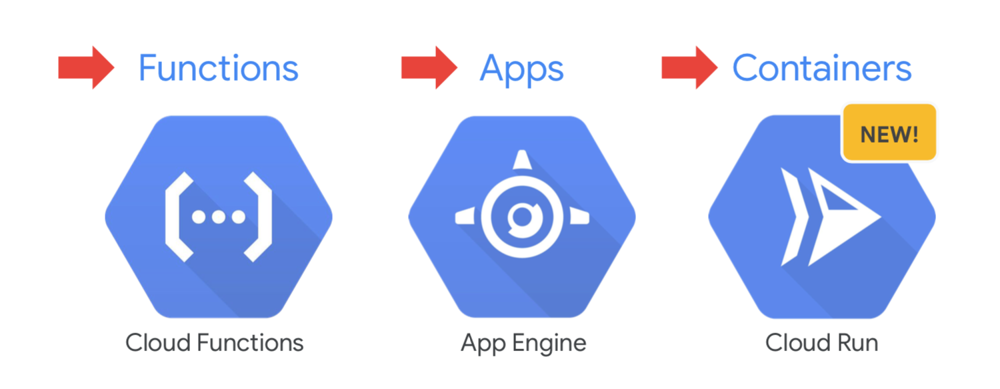

### Bring Serverless to Containers

这是 Cloud Run/knative 区别于之前的各种 serverless 产品的本质不同之处：支持的工作负载不再局限于 Function，而是任意容器！

> 备注：当然基本的容器运行时契约还是要遵守的，具体要求见下面的介绍。

和 Function 相比，以 container 方式呈现的工作负载，给使用者更大的自由度，Google Cloud 对此给出的口号是：

- Any langurage / 不限语言
- Any library / 不限类库
- Any binary 不限二进制文件（备注：格式还是要限制的，要求 Linux x86_64 ABI 格式）
- Ecosystem of base images / 基础镜像的生态系统
- Industry standard/工业标准

Google Cloud Run / Knative 对容器的要求，和通用容器相比，强调 **无状态（Stateless）** / **请求驱动（request-triggered）** / **可自动伸缩（autoscaled）**：

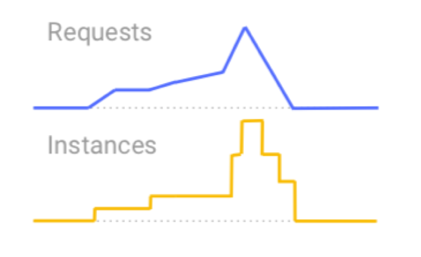

如上图所示，请求流量通常并非均匀分布，有突发高峰，有长期低谷，甚至有时没有流量。因此，从资源使用率的角度考虑，处理这些请求流量的服务容器的实例也应该随请求流量变化，做到自动伸缩，按需使用，以节约成本。

## Cloud Run的特性和要求

### Cloud Run 的特性概述

下图是整理的 Cloud Run 的几个主要特性，其核心还是那句口号 "Bring Serverless to Container"：

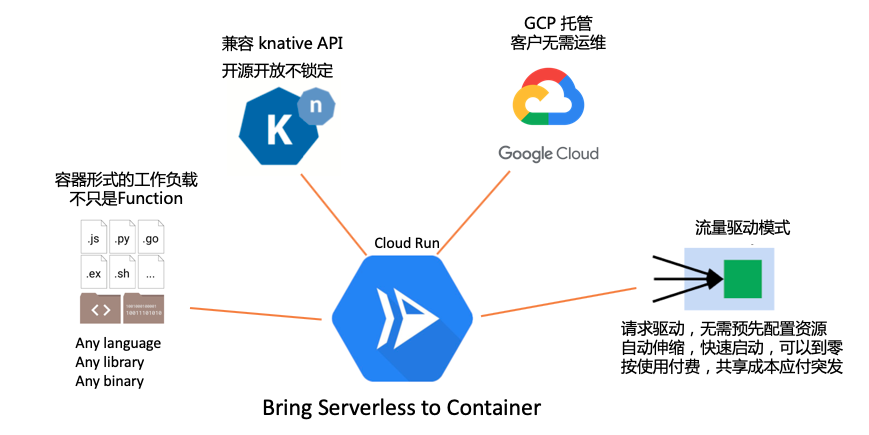

- 以容器形式出现的工作负载：不只是 Function，极大的丰富了 serverless 的玩法
- 兼容 knative API：这也是近年来 Google 的一贯打法，开源项目先行，对社区开放，拉拢盟友建立标准，以无厂商锁定的风险来吸引客户，我将其简称为"开源开放不锁定"。
- GCP托管：托管的好处自然是客户无需运维，这也是 serverless 的由来和最基本的特性
- 流量驱动模式：请求驱动，实例数量可自动伸缩，甚至伸缩到0，因此无需在业务高峰时预先配置资源和事后手工释放资料，极大的减少运维需要。在此基础上，执行按使用付费，因此可以在不同的应用之间（在公有云上则可以在不同的客户之间）共享成本，以低成本的方式应付短期突发高并发请求。

Cloud Run 的其他特性还有：

- 快速从容器到生产部署
- 开发体验简单
- 高可用：自动跨区域的冗余
- 和 Stackdrive的集成，监控/日志/错误报告都是开箱即用
- 可自定义域名

这些特性容易理解，就不一一展开。

### 适用于更多的场景

传统的基于 Function 负载的 serverless，受限于 Function ，适用范围相对有限，尤其不适合非 Function 方式编写的旧有应用，而将应用改造为 Function 一来工作量巨大，二来也不是所有的应用都适合用 Function 形式开发。

在以 Function 为负载的 serverless 系统中，调用往往发生在外部对 Function 的访问，类似API gateway下的南北向通信。Function 之间通常不直接相互调用（某些情况下需要调用时，往往也是走外部调用的通道），因此调用关系相对简单。

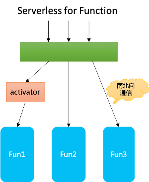

当工作负载从 Function 转变为 Container之后，不仅仅有 serverless 原有的南北向通信，而且以容器形态出现的工作负载之间相互调用的场景大为增加，这些负载之间的相互调用类似于传统SOA/微服务框架的东西向服务间通信。Cloud Run 通过支持容器作为工作负载，极大的扩大了 serverless 的适用范围。

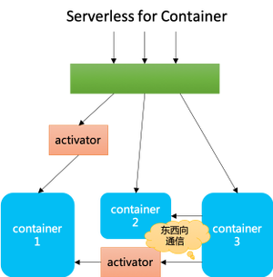

除了前面列出来的两种场景之外，Cloud Run 还可以适用于其他场景，如事件驱动/异步任务/调度服务等：

这也迎合了目前 serverless 的发展趋势：未来 serverless 将渗透到各种场景，任何需要按照请求自动实现资源动态调度的工作负载都应该 serverless 化。我称之为：**万物皆可 serverless**！从 Function 到 Container，serverless 朝这个目标迈出了一大步。

### Cloud Run的并发模型

重点看一下 Cloud Run 对请求并发的处理，因为这涉及到如何动态调配服务容器实例的个数。

在 Cloud Run 中，每个服务都要自动伸缩容器的实例数量来应对请求流量。在 Cloud Run 中对并发（Concurrency）的定义是：

> **Concurrency** = "maximum number of requests that can be sent at the same time to a given container instance" 
>
> 并发 = "可以同时对给定容器实例发送请求的最大数量"

也就是我们平时理解的"最大并发请求数"，或者"最大工作线程数"。在这一点上，Cloud Run 的做法和 AWS Lambda 还有 Google 自己的 Cloud Function 不同，后两者的做法是每个实例只能同时接受一个请求，相当于 “Concurrency=1”。如图，当有多个并发请求时就需要启动多个实例。

而在 Cloud Run 中，并发度是可以设置的，容许的值范围是从1到80，默认值是80，如下图所示：

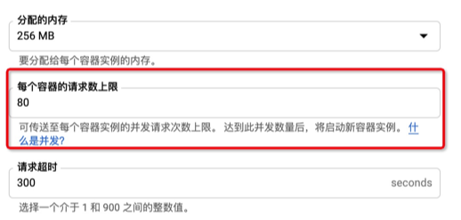

如果并发度设置为 1 则 Cloud Run 的行为也就和AWS Lambda/Google Cloud Function一致了，不过对于容器形式的工作负载而言，容器启动和销毁的资源消耗和成本就有过高了，因此 Cloud Run 下通常建议根据实际业务场景设置合适的并发度/请求数上限。这样在处理请求时，可以用一个实例对应多个请求，从而不必启动太多的实例。

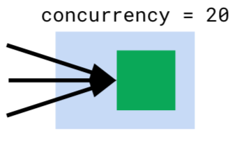

### Cloud Run对容器的要求

在 Google Cloud Run 的文档中， [Container运行时契约](https://cloud.google.com/run/docs/reference/container-contract) 中列出了 Cloud Run 对容器的要求，主要包括：

- 语言支持

	可以使用任意语言编写代码，可以使用任意基础镜像，但是容器镜像必须是为64位Linux编译的; Cloud Run 支持 Linux x86_64 ABI 格式

- 请求监听

	容器必须在 `0.0.0.0` 上监听，端口由环境变量 `PORT` 定义。目前在 Cloud Run 中，PORT 环境变量总是设置为 8080，但是为了可移植性，不能hardcode。

- 启动时间和响应时间

	容器实例必须在收到请求后的四分钟内启动HTTP服务器; 容器实例必须收到HTTP请求后的规定时间内发送响应，该时间由 [`request timeout setting`](https://cloud.google.com/run/docs/configuring/request-timeout) 配置，包含容器实例的启动时间。否则请求会被终止并返回 504 错误。

- 文件访问

	容器的文件系统是可写的并受以下影响：

	- 文件系统是基于内存的，写入文件系统会使用容器实例的内存
	- 写入到文件系统中的数据不会持久化. 

- 容器实例生命周期考虑
	
	服务的每个版本都将自动伸缩，如果某个版本没有流量，则会缩减到 0 。

	服务应该是无状态的，计算应该限定于请求的范围，如果没有请求则不能使用CPU。

- 容器实例资源

	每个容器实例分配 1 vCPU 而且不能修改。每个容器实例默认256M内存，可以修改，最多为2G。

请注意，Cloud Run 目前处于测试阶段，因此这些要求可能会随时间而发生变化。

Container Runtime Contract 更详细的信息，请参考：

- [Google Container Runtime Contract ](https://cloud.google.com/run/docs/reference/container-contract) 
- [Knative Container Runtime Contract](https://github.com/knative/serving/blob/master/docs/runtime-contract.md)
- [Open Container Initiative Runtime Specification](https://github.com/opencontainers/runtime-spec/blob/master/spec.md)

### Cloud Run的限制

目前 Cloud Run 的限制有：

- 最多 1 个vCPU 和 2 G内存
- 不能访问 GPU
- 没有 Cloud SQL （即将提供）
- 没有 VPS 访问（即将提供）
- 不支持全局负载均衡
- 只支持 HTTP （未来会支持gRPC）

而这些限制，都可以通过选择使用 Cloud Run on GKE 来解决。

### 安全容器gVisor的使用

gVisor 是由 Google 开源的容器沙箱运行时(Container sandbox runtime)。用于在宿主机操作系统与容器中的应用之间创建一个安全的隔离边界，便于安全的对外提供大规模部署的容器服务——关于安全容器和 gVisor 的介绍就不在这里展开。

在 Cloud Run 中，容器是运行在 gVisor 之上的，而不是默认的Kubernetes runc runtime。gVisor为 Cloud Run 带来了安全容器的隔离，但是也带来了一些限制。如下图所示，gVisor 支持的 System Call 是有限的，不支持所有的 Linux System Call。但是考虑到 Cloud Run 的主要使用场景是无状态的 HTTP 容器，正常情况下应该不会触发这个限制。

## 和knative的关系

Google Cloud 给出的一些PPT中宣称 Cloud Run 就是托管版本的 knative，当然这一点我个人有些质疑：当前开源版本的 knative 实在有些不够成熟，应该还达不到生产级强度，Google Cloud 托管的有可能是 knative 的内部版本。但可以肯定的是，Cloud Run 一定是兼容 knative API 的。

目前 Knative 发展趋势非常不错，尤其社区快速成长，聚拢了一批大小盟友。这里有一份 google 给出的长长列表，列出了当前参与 knative 开发的贡献者来自的公司：

> VMware, Huawei, Cisco, TriggerMesh, Dropbox, SAP, Microsoft, Schibsted, Apache, Independent, China Mobile NTT, CloudBees, Caicloud, Inovex, Docker, Heureka, CNCF, Liz Rice, Zalando, Douyu.com, Nebula. OpsGenie. Terracotta, Eldarion, Giant Swarm, Heroku, Revolgy, SORINT.lab, Switch, Ticketmaster, Virtustream,, Alipay, Blue Box, Cruise Automation, EPAM Systems, EVRY, Foreningen Kollegienet Odense, Giddyinc, IPB, Manifold.co, Orange, Puppet, Stark & Wayne, Weaveworks, Disney Interactive, Ivx, Mediative, Ministère de l'Agriculture et de l'Alimentation, NatureServe, Samsung SDS. Typeform, Wise2c

当然，其中最重要的力量还是来自 google 自己，以及 Redhat、Pivotal、IBM 这三位社区巨头。下图是以公司为单位的贡献度比例：

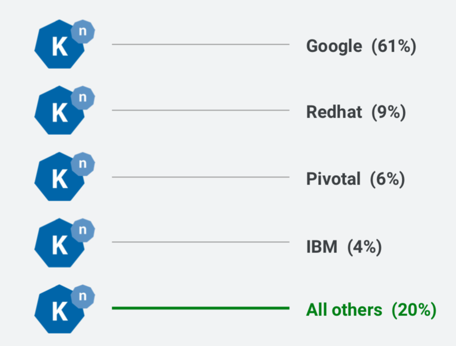

下图是基于Knative的几个主要 serverless 产品，除了Google 的 Cloud Run 之后，还有 Redhat / Pivotal / IBM 等大厂：

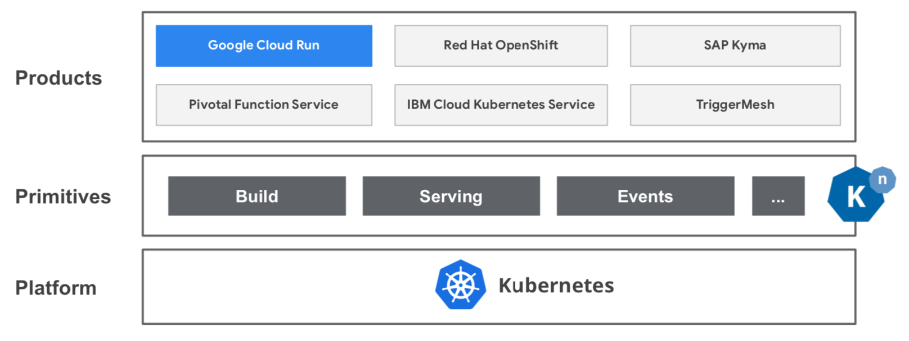

## Serverless计算平台选择

Cloud Run是一个serverless计算平台，用于运行无状态HTTP应用程序。 它有两种风格：完全托管的环境或Google Kubernetes Engine集群。 

1. Cloud Run：完全托管，完整的serverless体验，客户不需要管理集群，按使用付费。

2. Cloud Run on GKE：只具有 serverless 的开发体验，客户需要在自己的 GKE 集群中运行，价格包含在 GKE 集群中。

  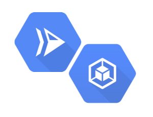

Cloud Run on GKE 具有和 Cloud Run 相同的开发体验，但是 Cloud Run on GKE 运行在 k8s 上，有更多的灵活性和控制力，不过需要自己运维。Cloud Run on GKE 可以集成基于k8s的策略、控制和管理。允许访问自定义计算机类型，额外的网络和GPU支持，以扩展Cloud Run服务的运行方式。

可以在 Cloud Run 和 Cloud Run on GKE 之间按需要选择，另外 Google Cloud 容许在 Cloud Run 和 Cloud Run on GKE 之间切换，无需改动应用。

Cloud Run 和 Cloud Run on GKE 的详细对比：

|            | Cloud Run                                                  | GKE上的Cloud Run                                        |
| :--------- | :--------------------------------------------------------- | :------------------------------------------------------ |
| 价钱       | 按使用付费（见下文）。                                     | 作为Kubernetes Engine的一部分提供。定价将在GA之前确定。 |
| 机器类型   | 每个实例一个vCPU，可以更改内存                             | GKE上的标准或自定义机器类型，包括GPU。                  |
| 身份和政策 | 管理允许调用服务的身份（或允许未经身份验证的调用）。       | 将服务发布到Internet或仅将其提供给群集或VPC网络。       |
| 联网       | 无法访问VPC /计算引擎网络。服务不是Istio服务网格的一部分。 | 访问VPC /计算引擎网络。服务参与Istio服务网格。          |
| 网址       | 自动提供URL和SSL证书                                       | 自定义域仅包含手动SSL证书。                             |

考虑到 Cloud Run 是 knative 的 google cloud 托管版本，对于客户，则理论上在 Cloud Run 和 Cloud Run on GKE 之外还存在另外一种选择：直接使用开源版本的 knative。

或者 google 之外的其他基于 knative 的产品，如Redhat / IBM / Pivotal 等，从而避免了供应商锁定的风险。

这也是google 在宣传 Cloud Run 产品是一直反复强调的：开源、开放、不绑定。 

回到在 google cloud上进行 serverless 平台选择这个话题，现在 google cloud 上的 serverless 有 function/app/container三种模式，而其中的 container 模式又可以细分为 Cloud Run 和 Cloud Run on GKE 两种形态，还有一个自由度极高可以自由发挥的GKE。下图摘录自 google 的演讲PPT，做了很好的分类和总结：

## Cloud Run的计费

最后关注一下 Cloud Run的计费，Cloud Run 的官方文档 [Pricing](https://cloud.google.com/run/pricing) 对此有详细的描述，这里摘录部分内容。

首先，完全托管式的 Cloud Run 仅为使用的资源收取费用，计费到最近的100毫秒。而 Cloud Run on GKE 则不同，GKE上的 Cloud Run 是Google Kubernetes Engine集群的附加组件。而 Cloud Run on GKE部署的工作量包含在GKE定价中。而GKE上 Cloud Run 的最终定价要到 GA 才确定。

Cloud Run 的计费模型也颇具创新性，不是完全按请求数量计费，而是同时考量三个指标：CPU/内存/请求数量。搬运一下官方文档作为示意：

| CPU                                          | Memory                                    | Requests                                   | Networking        |
| :------------------------------------------- | :---------------------------------------- | :----------------------------------------- | :---------------- |
| First 180,000 vCPU-seconds free              | First 360,000 GB-seconds free             | 2 million requests free                    | Free during beta. |
| $0.00002400 / vCPU-seconds beyond free quota | $0.00000250 / GB-second beyond free quota | $0.40 / million requests beyond free quota | 测试期间免费      |

按照这个计费模型，将 concurrency 设置为合适的数值（起码不是1），让一个容器实例可以同时服务多个请求，分享CPU和内存，在费用上会更合适。另外上面的计费信息中可以看到，CPU/内存/请求数量都有免费配额，只有超过免费配额的使用才需要付费。免费配额会每月重置。

Cloud Run 对可计费时间的计算比较良心，只有在容器实例有请求在处理时才计算，从第一个请求开始到最后一个请求结束。而容器实例启动的时间和空闲的时间不计算在内，如下图所示：

## Cloud Run 分析

总结前面的功能介绍，我们可以看到，在 serverless 的常规特性和托管带来的运维便利之外，Cloud Run 的主要特性和卖点在于：

- 拥抱容器生态

	将 serverless 与容器结合，极大的扩展了 serverless 的适用范围，对于 serverless 市场是一个巨大的创新。对于习惯使用容器/微服务技术的客户，可以更好的迁移过来。

- 拥抱社区

	基于开源的 knative，拉拢社区和盟友，通过 knative 实现 serverless 的标准化和平台化，解决了 serverless 市场碎片化的问题。
	
- 极佳的可迁移性
	
	为客户提供了没有供应商锁定风险的解决方案。理论上	客户可以根据实际需要选择完全托管的 Cloud Run 或 Cloud Run on GKE，或者开源版本的 knative，以及其他基于 knative 的托管平台，。

- 拥抱云原生技术栈

	结合使用 servicemesh 技术和安全容器技术，配合容器/kubernetes，用 Cloud Native 技术栈打通了从底层到上层应用的通道。

总结说，Cloud Run 是 Google Cloud 在 serverless 领域的全新尝试，具有创新的产品思路，未来的发展值得关注和借鉴。 

## 参考资料

Cloud Run 刚刚发布才一个多月，目前能找到的资料不多，基本都是Google Cloud放出来的新闻稿/博客和官方文档，还有Cloud Next大会上的介绍演讲及PPT。第三方的介绍文章非常的少，因此在调研和整理资料时不得不大量引用来自Cloud Run官方渠道的资料和图片。

- [Cloud Run官网](https://cloud.google.com/run/)
- [Cloud Run Overview](https://www.youtube.com/watch?v=gx8VTa1c8DA): 不到2分钟的介绍视频，官方宣传片
- [Differences between Cloud Run and Cloud Run on GKE](https://www.youtube.com/watch?v=RVdhyprptTQ): 官方视频，5分钟长度，展示 cloud run 和 Cloud Run on GKE 之间的相同点和不同点。
- [Google Cloud Next' 19 大会上和 serverless 相关的演讲](https://cloud.withgoogle.com/next/sf/)：主要信息还是来自 Next' 19 的演讲，在这个页面中选择 "serverless" 会列出本次大会和 serverless 相关的演讲，大概十余个，视频可以回放，也提供PPT下载。（本文的大部分的信息和图片来自这些演讲内容），数量比较多就不一一列举了。

