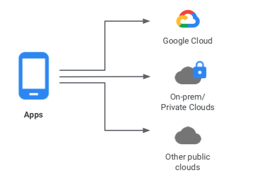
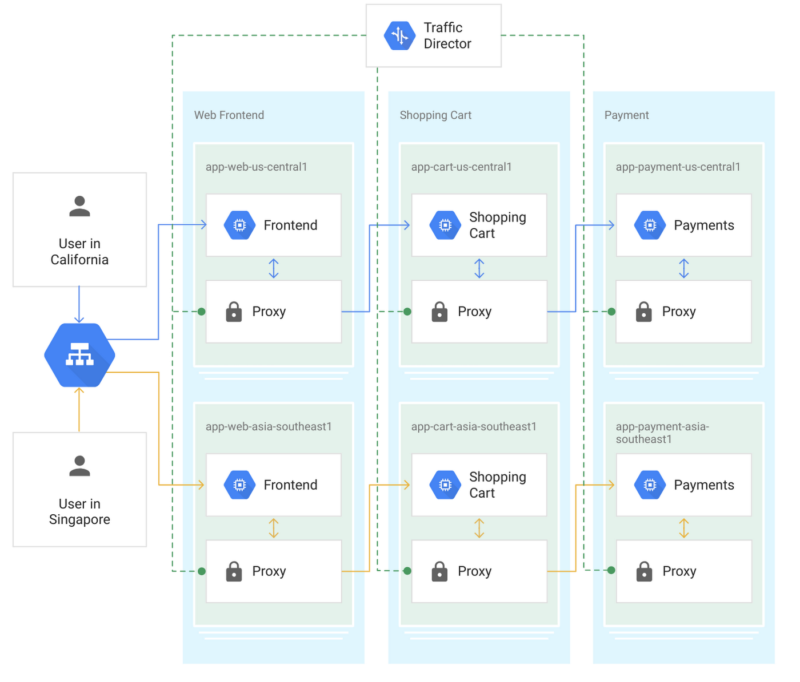
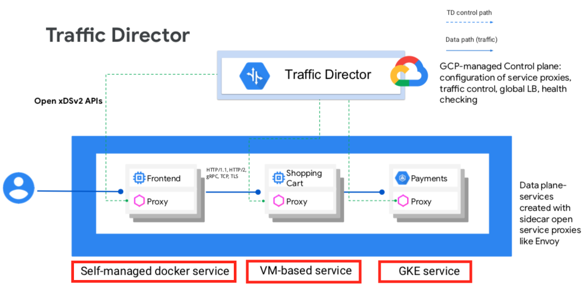
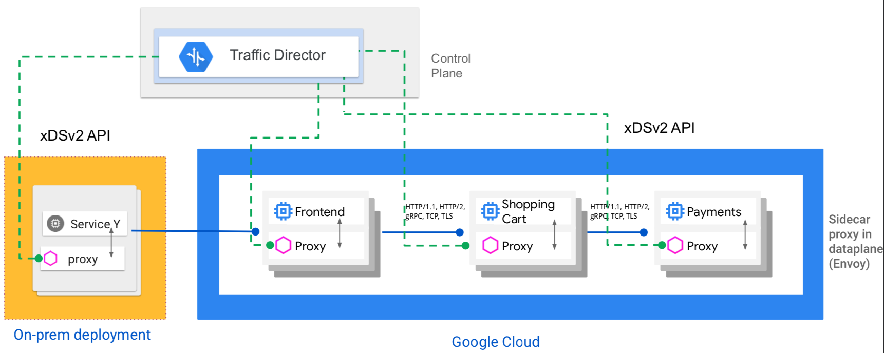
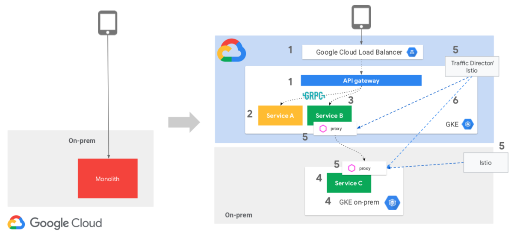
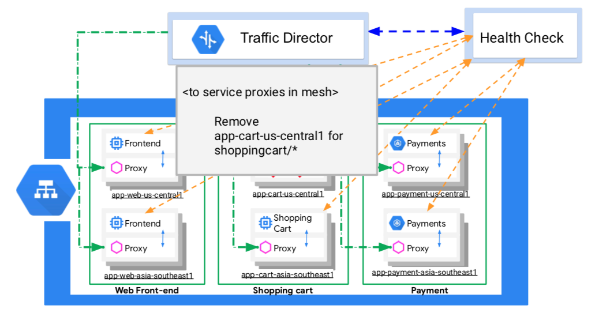
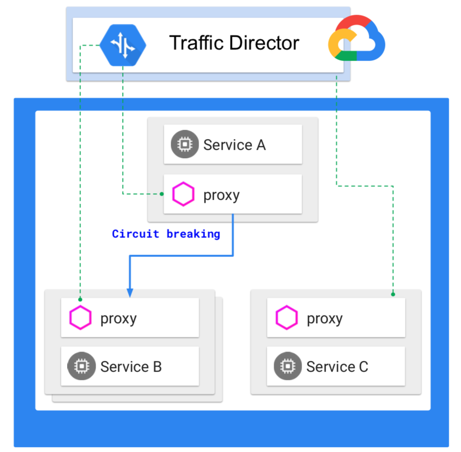
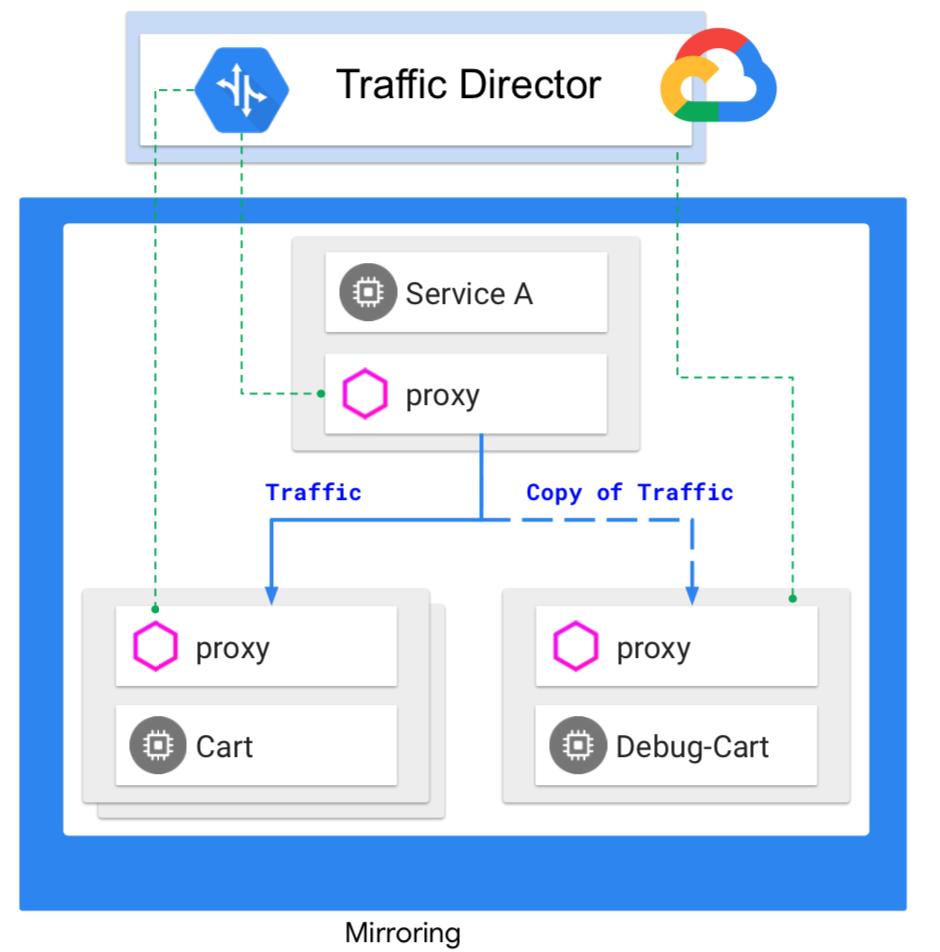
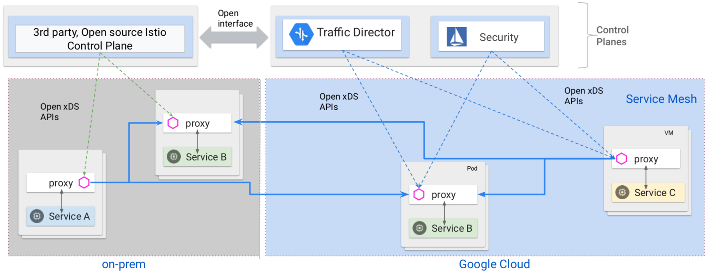

+++
title = "Google Traffic Director详细介绍"

date = 2019-05-06
lastmod = 2019-05-06
draft = false

tags = ["服务网格", "Traffic Director"]
summary = "Google最近宣布用于服务网格的Traffic Director beta测试版，为VM和容器服务带来全局流量管理。本文将对 Traffic Director 进行详细介绍。"
abstract = "Google最近宣布用于服务网格的Traffic Director beta测试版，为VM和容器服务带来全局流量管理。本文将对 Traffic Director 进行详细介绍。"

[header]
image = "headers/post/201904-microservice-anti-patten.jpg"
caption = ""

+++

## Traffic Director介绍

Traffic Director 是 Google Cloud 推出的完全托管的服务网格流量控制平面。

援引来自Traffic Director官方网站的介绍资料，Traffic Director的定位是：

> Enterprise-ready traffic management for open service mesh.
> 
> 适用于开放式服务网格的企业级流量管理工具。

目前 Traffic Director 还处于测试阶段，尚未GA：

- 在2018年7月的 Cloud Next '18 大会上，Google Cloud 推出了 Traffic Director 的 alpha 版本
- 在2019年4月的  Cloud Next '19 大会上，Google Cloud 推出了 Traffic Director 的 beta 版本

## Traffic Director推出的背景

在详细介绍 Traffic Director 的功能之前，我们先看一下 Traffic Director 推出的背景。由于 Traffic Director 刚推出不久，资料非常少，所以下面的内容有很多来自仅有的一点 Traffic Director 的演讲和官方文档。

在Cloud Next '18 /19 介绍Traffic Director的演讲中，都谈到 Traffic Director 推出和下列两个趋势有关：

1. 微服务的普及和Service Mesh技术的兴起
2. 混合云和多云部署

### 从微服务到Service Mesh

近年来微服务架构大热，传统的单体应用按照微服务的理念进行拆分。

但是当应用从单个巨型单体拆分为数量大增的微服务之后，新的问题出现：如果高效的部署、连接、管理这些服务，并提供安全和监控能力？如果按照传统的侵入式微服务框架的思路，则开发人员就不得不在进行微服务改造时，承受微服务拆分带来的各种技术复杂度。

但是，当将单体应用拆分到微服务时，客户关注的并不是微服务或者和微服务相关的各种技术，他们真正关注的是：微服务可以给他们带来什么。因此，必须要有一种解决方案，抽象并屏蔽掉微服务实现的技术细节。

服务网格就是这样一种功能强大的抽象层，在微服务交付方面得到了越来越多的使用。其核心价值有两点：

- Separates applications from app networking / 分离应用和网络
- Decouples operation from development / 解耦开发和运维

### 混合云和多云环境

考虑另一个趋势：在混合云和多云环境下部署和管理服务。客户可能使用公有云，如GCP或其他公有云，也可能混合使用私有云。

在这种场景下，该如何简化混合和多云服务的部署？Traffic Director的思路是这样：

1. 引入ServiceMesh技术：通过ServiceMesh将通用的核心部分从服务中移除，典型如网络通信代码中的负载均衡，错误注入，失败恢复，流量管理，路由，安全等。
2. 托管：需要ServiceMesh来管理服务，但最好不要自己直接管理ServiceMesh，而是使用提供托管的基础设施

### 控制平面与托管

在服务网格中，服务网格数据平面与服务代理一起传输流量，而服务网格控制平面为这些服务代理提供政策、配置和智能建议:

Traffic Director 是 GCP 专为服务网格打造的完全托管式流量控制平面，其架构如下：

托管式服务的好处是有服务等级协议 (SLA) 的保障，下面是Google Cloud官方对此的声明：

> 作为 Google 的一项托管式服务，Traffic Director 提供生产级 99.99% 可用性的 SLA：如果出现问题，收到通知并负责解决问题是我们的运营人员，而不是您的。您不必担心部署和管理控制平面，因而您的员工可以专注于发展业务。

当然目前 Traffic Director 还是beta测试阶段，上述SLA保障需要在GA之后才能提供。

最后我们援引 Matt Klein（Envoy 作者）的这段致辞作为Traffic Director推出的背景总结，虽然这段话有做托的嫌疑：

> “Traffic Director 可以更加便捷地将 Envoy 和服务网格的优势运用到生产环境。由于 Envoy 提供通用型数据平面，Traffic Director 可提供具有开放接口的完全托管式流量控制平面，避免锁定于某一种产品。Traffic Director 的 SLA、全球负载平衡和丰富的流量控制措施可帮助企业和云原生最终用户减少流量管理工作。”
>

这里列出的功能我们后面会详细解析，重点看"开放接口"/"避免锁定" 这两个关键词：这可以说是Google乃至整个CNCF/Cloud Native社区一直念念不忘反复提醒的关键字，极其强调标准接口和避免供应商绑定。

与此对应的是，Traffic Director 采用了开放的 [xDS v2 API](https://www.envoyproxy.io/docs/envoy/latest/api-v2/api) 与数据平面中的服务代理进行通信。xDS v2 API 来自 Envoy， 目前已经成为 Service Mesh 的事实API标准。Traffic Director 通过采用 xDS v2 API 这样的开发API实现了其倡导的避免绑定。

## Traffic Director的功能

### 全局负载均衡

这个功能是 Traffic Director 在各种演讲和介绍中强调的最多的功能，其官方介绍为：

> Traffic Director 将服务作为虚拟机或容器部署在多个区域中来保证它正常运行，并使用 Traffic Director 通过自动化的跨区域溢出和故障转移来提供全局负载均衡。

"作为虚拟机或容器"我们在下一节展开，先看看 Traffic Director 提供的全局负载均衡是什么。

这是  Traffic Director 官方给出的示例，图中的三个服务分别部署在两个不同的区域。在 Traffic Director 的控制下，流量按照就近原则被发送到具有可用容量的最近的服务实例：

故障转移是指，如果最接近客户端服务的实例已关闭或过载，则 Traffic Director 会控制流量无缝转移到下一个最近区域中的健康实例。

跨区域溢出则是指当流量超出当前区域部署的实例的承受能力之后，会突破就近路由的原则，将部分流量导流到其他区域。这背后的逻辑是：就近路由的收益的是本地访问的低网络延迟，在流量突发时，宁可牺牲延迟也要将流量引导到其他区域以保证可用性。

下面这个动画可以更生动的展示上述描述的"全局负载均衡"/"故障转移"和"跨区域溢出"的功能：

### 适用于虚拟机和容器

在上面的示例中，提到"Traffic Director 将服务作为虚拟机或容器部署在多个区域中"，这是 Traffic Director 重点强调的另外一个重要功能：支持虚拟机和容器，而且支持混合使用。

下面这张图片强调了服务部署的多样性：三个服务分别是自己管理的 docker 服务 / 基于虚拟机的服务 / 部署在 GKE 的服务。 

Traffic Director 官方文档给出的解释是：

> "按您的节奏进行现代化改造"
> 
> Traffic Director 既适用于基于虚拟机 (Compute Engine) 的应用，也适用于容器化应用（Google Kubernetes Engine 或自行管理的 Kubernetes），并可以增量方式逐步应用于您的服务。

这背后的考虑是：service mesh 和 k8s 的普及，不会一蹴而就，基于虚拟机的服务会长期存在，因此提供对基于虚拟机服务的支持和打通与容器服务的交互访问就至关重要。这个思路同样出现在AWS的app mesh产品中，app mesh也是强调同时支持VM服务和容器服务。

Service Mesh技术的典型使用场景是运行和管理已经拆解为微服务并按照云原生理念开发的服务，但是考虑到大量遗留应用存在的现实， Traffic Director 通过支持VM服务，可以为这些非云原生服务引入高级功能。这个做法在我们之前的介绍中，被戏称为"先上车再买票"，即在不做应用大规模改造的前提下先体现享受Service Mesh带来的部分红利，再慢慢逐步和分批做应用改造。

注意：在 Traffic Director 的支持中，基于虚拟机的服务和基于容器的服务采用一致的流量管理功能，两者并没有功能上的差别。

### 混合云和多云支持

最近看到 Google Cloud 提出要"All in Hybird Cloud"，在这个大背景下，Traffic Director 提供对混合云和多云环境的支持：

这是完整的应用改造示意，从原有在私有环境下运行的单体应用，转换到在公有云和私有云上的 service mesh 中运行的多个微服务：

### 集中式健康检查

Traffic Director 官方文档对集中式健康检查给出的介绍是：

> 大规模执行运行状况检查
>
> Traffic Director 通过 GCP 进行大规模运行状况检查。因此，运行状况检查从 Envoy/服务代理分流到 Google 的弹性系统，这样您就可以对各种规模的部署进行大规模运行状况检查。另外，您的实例本身不会因网格规模的运行状况检查而不堪重负。

解释一下这里所说的"因网格规模的运行状况检查而不堪重负"：

> 大型服务网格会生成大量的健康检查流量，因为每个sidecar代理都必须对服务网格中的所有服务实例进行健康检查。随着网格的增长，让每个客户端代理健康检查每个服务器实例，这种做法会产生一个 n^2 健康检查问题，这将成为增长和扩展部署的障碍。

Traffic Director 对此给出的解决方案是提供集中式健康检查，Traffic Director 会提供一个全局分布的弹性系统监控所有服务实例。然后，Traffic Director使用 [EDS API](https://www.envoyproxy.io/docs/envoy/latest/api-v2/api/v2/eds.proto#envoy-api-file-envoy-api-v2-eds-proto) 将聚合的健康检查结果分发到全局网格中的所有代理。如下图所示：

这样Proxy就不需要自行实现健康检测，只要接受 EDS 更新即可（当然客户端被动健康检测还是需要的，当发生无法连接等错误时还是需要处理的）。

这里 Traffic Director 的做法和 Istio 的标准做法是很类似的，Istio 在 k8s 上部署时，是依赖 k8s 的探测机制来做服务的探活的。Traffic Director 的 health check 机制没有找到详细的介绍资料，暂时不清楚具体的机制，Traffic Director 的介绍中只是提到这个功能是由 GCP 统一提供。

集中式健康检查这个功能也算是一个卖点，毕竟，虽然 Envoy 自带健康检测机制，但是如果由客户端来实现健康检测，的确是需要每个客户端都检查所有其他服务，连接太多，请求太多，而且随着服务数量和实例数量的增加，健康检测的开销会直线上涨。由平台/基础设施/云等来统一提供集中式健康检查，再通过 xDS/EDS API 下发结果应该会是一个通用的做法。

### 流量控制

Traffic Director 目前提供流量控制功能，包括流量路由和策略执行。官方文档的介绍描述如下：

> 通过请求路由和丰富的流量政策进行流量控制（Alpha 版）
>
> Traffic Director 支持高级请求路由功能，如流量拆分、启用 Canary 更新等用例、网址重写/重定向、故障注入、流量镜像，以及基于各种标头值的高级路由功能，包括 Cookie。此外，Traffic Director 还支持许多高级流量政策，包括多种负载平衡方案、熔断和后端异常检测。
>
> 您可以使用 Traffic Director 轻松部署一切功能：从简单的负载平衡，到请求路由和基于百分比的流量拆分等高级功能。

从最新的 Traffic Director 的介绍PPT上看到，Traffic Director 的流量控制功能包含两个部分：

1. **Routing Rules**：定义请求如何路由到网格中的服务 

    - Traffic splitting 
    - Traffic steering 
    - Timeouts and retries 
    - Fault Injection 
    - Mirroring 

2. **Traffic Policies**：用于服务的路由相关策略

    - Load balancing schemes. 
    - Outlier detection. 
    - Circuit breakers 
    - Timeouts 

熟悉 Istio API 和 Envoy xDS API 的同学就会发现这些功能非常眼熟，基本上和 Isito / Envoy 提供的功能相同。

和包括Istio在内的所有Service Mesh产品一致， Traffic Director 也在强调说这些功能都是可以在不修改应用代码的前提下获得，这是理所当然的重要卖点。

但是注意：目前这些功能都还是 alpha 阶段，因此支持度应该不会像 Istio 那么齐全。

我们快速过一下目前提供的功能（图片来自 Google Traffic Director 的演讲PPT）：

Traffic Splitting/流量拆分，支持百分比拆分，这是 version based routing，用于实现金丝雀发布/蓝绿部署/AB测试等：

Traffic Steering，这是 content based routing，支持 Host / Path / Header 匹配：

在匹配完成之后，除了做流量拆分之外，还可以由其他的功能，如错误注入。Traffic Director 支持的错误注入同样有 Delay 和 Abort 两种：

熔断和异常检测，支持每服务配置，具体的配置方式也和 Istio / Envoy 差不多。

流量镜像功能，也称为影子流量。流量会复制一份发送给接受镜像流量的服务，Traffic Director的实现会在发送给镜像服务的请求的 Host/Authority header 中增加一个 “-shadow” 后缀。镜像请求是发出去就不管的，无视应答，和Istio的处理方式一致。

总结：在流量控制这块功能上，Traffic Director 除了因为是 alpha 版本，可能功能支持不够齐全之外，基本和 Istio / Envoy 是一致的。考虑到 Traffic Director 支持 xDS V2 API，和目前只支持Envoy（理论上兼容任何支持 xDS v2的代理，但是实际只测试过Envoy） 的现状，Traffic Director 在流量控制上和 Istio / Envoy 高度一致也就非常容易理解。

需要特别指出的是：目前 beta 版本的 Traffic Director 只支持用 GCP 的 API 来设置流量控制的规则，目前还不支持直接使用 Istio 的API （CRD）。但是，预计未来将提供支持，从Roadmap上也看到有和 Istio 集成的规划。

### 基于流量的自动伸缩

Traffic Director 前面支持的功能，基本都有不出意外的感觉，毕竟熟悉 Istio/Envoy 体系的同学对这些功能都了如指掌。而 自动伸缩这个功能是一个特例。

援引 Traffic Director 官方文档对此功能的描述：

> 根据您的服务规模智能快速进行地自动扩缩
>
> Traffic Director 可根据您的需求自动扩缩，您只需按实际用量付费，并且快速智能地进行扩容，无需联系云服务提供商也不必进行任何预热。

看到这段描述，第一反应是：这不是 serverless 吗？按需伸缩，按使用付费。

Traffic Director 在提供标准的 service mesh 功能的同时，也引入了 serverless 的特性。下面是 Traffic Director 中自动伸缩功能的实现方式： 

> Traffic Director 根据代理向其报告的负载信号启用自动伸缩。Traffic Director通知 Compute Engine autoscaler 流量变化，并让 autoscaler 一次性增长到所需的大小（而不是像其他 autoscaler 那样重复步骤），从而减少 autoscaler 对流量峰值做出反应所需的时间。

自动伸缩的功能不仅仅可以用于常规的按照请求流量进行扩容和缩容，也支持某些特殊场景，如前面在介绍全局负载均衡时提到的：如果最接近客户端服务的实例已关闭或过载，则 Traffic Director 会控制流量无缝转移到下一个最近区域中的健康实例。

此时由于原来两个区域的流量都进入了一个区域的Shopping Car服务，可能出现流量超出当前承受能力的情况，此时 Traffic Director 会指示 Compute Engine autoscaler 增加Shopping Car服务的容量。同理，Payments 服务的容量也会随之增加。

按照 Google Cloud 官方博客文章的介绍， Traffic Director 在这块的处理非常的复杂而智能：在新增加的容量生效之前，Traffic Director 会暂时将流量重定向到其他可用实例 - 即使在其他区域也是如此。（也就是前面所说的跨区域溢出，其指导原则是可用性目标高于低延迟目标）一旦 autoscaler 增加了足够的工作负载容量以维持峰值，Traffic Director 就会将流量移回最近的zone和region，再次优化流量分配以最小化每个请求的RTT。

从这里可以看到， Traffic Director 结合使用了 Service Mesh 的路由控制能力和 Serverless 的按需自动伸缩的资源调度能力，在故障处理和自动运维上表现非常突出。

 可以说，Traffic Director 在 servicemesh 和 serverless 整合的道路上迈出了重要的一步。这是一个非常有创新的想法，值得借鉴和学习。

### 功能限制

 Traffic Director 官方文档中列出了一些目前的功能限制，这里摘录其中比较重要的部分：

- Beta版本的Traffic Director仅支持GCP API。Beta版本的Traffic Director不支持Istio API。
- Traffic Director仅支持HTTP流量。
- Traffic Director流量控制功能是 Alpha 状态。
- 本文档讨论了Envoy代理，但您可以将任何 [开放标准API（xDS v2）代理](https://www.envoyproxy.io/docs/envoy/latest/api-v2/api) 与Traffic Director一起使用。但请注意，Google仅使用Envoy代理测试了Traffic Director。在此测试期间，Traffic Director仅支持Envoy版本1.9.1或更高版本。

## 和Istio的关系

在了解 Traffic Director 之后，相信很多人会和我一样有同样的问题：Traffic Director 和 Istio 到底有什么关系？

简单介绍Istio：Istio提供控制平面来保护，连接和监控微服务。它有三个组成部分：Pilot 负责流量管理，Mixer 负责可观察性，Istio Security（Citadel） 负责服务到服务的安全性。

Traffic Director 和 Istio 的基本区别在于，Istio 是一个开源产品，而 Traffic Director 是一个完全托管的服务。

在具体的功能模块上，Traffic Director 将取代 Pilot 的位置：所有 Pilot 能提供的功能，Traffic Director 都将提供。这也是采用 open xDS v2 API的原因，以便在开源的 Pilot 和 Traffic Director 之间切换。

总结说：Traffic Director 提供了 GCP 托管的 Pilot ，以及全局负载均衡和集中式健康检查等其他功能。

但请注意，当前 Traffic Director Beta 版本还无法使用 Istio API 配置 Traffic Director，暂时只能使用GCP API进行配置。

在 Sidecar 的注入上，Istio 支持自动注入，而 Traffic Director 目前需要手工注入 Sidecar，不过未来 Traffic Director 应该会支持自动注入，毕竟这个功能实现上并不复杂。

Traffic Director 的 Roadmap 中，有和 Istio 进一步集成的计划，从下图上看是准备引入 Istio Security（Citadel），以提供安全特性如mTLS，RBAC等。

暂时未看到有引入 Mixer 的信息。

## Traffic Director Roadmap

援引最新 Traffic Director 介绍的PPT，Traffic Director 的 Roadmap 中未来准备加入以下内容：

- 安全方面的集成，要支持 mTLS/RBAC，看前面的图片是打算引入Istio Security （Citadel）模块。

- 可观测性集成：按说是Istio Mixer模块，但是没见到介绍，怀疑是不是因为 Mixer 在性能上的拙劣表现，导致Traffic Director 可能采用其他方案，后续关注。

- hybird/Multi-cloud支持

- 通过 Istio API 来进行控制

- 和其他控制平面组建联邦

    

## Traffic Director 分析

从前面的功能介绍中可以看到，Traffic Director 的重要卖点和特色在于：

1. 对混合云/多云的支持
2. 对VM服务（或者说非云原生服务）的支持
3. 整合了 serverless 的部分特性

其他功能不是说不重要，而是相对来说比较常规化，即托管的服务网格理论上说应该都会提供这些功能：

- 完全托管，无需运维，GA后提供SLA保证
- 流量管理（包括路由和策略）/安全/可观测性
- 全局负载均衡
- 集中式健康检查

从产品定位上说，Traffic Director 只提供控制平面，对于数据平面理论上只要兼容xDS v2 API即可，也就是说 Traffic Director  完全关注在控制平面，前面列出来的几个重要的卖点也都属于控制平面的创新和深耕，和数据平面关系不大，或者说数据平面只需简单的提供底层支持。从这点上看，和Istio专注在控制平面，而将数据平面完全委托给 Envoy 的做法可谓一脉相承。

在API的选择上，Traffic Director 的做法是支持开放的 xDS v2 API，以及计划中的通过 Istio API 来进行配置。一方面在产品层面上和开源的Envoy/Istio保持一致，另一方面也通过这种方式实现了其一直宣传的不锁定的目标，对于市场宣传和争取客户应该是有利的，也有助于实现混合云和多云战略。

目前 Traffic Director 还处于 beta 测试阶段，尤其流量配置更是还在 alpha 阶段，产品的成熟度还不够高，roadmap中也还有很多非常重要甚至急迫（如可观测性）的内容有待完成。因此不适合对 Traffic Director 过早的做判断和评论，个人的观点是 Traffic Director 代表的产品方向应该是非常有前途，可以给客户带来实际价值。这是Google 在ServiceMesh领域（甚至是Serverless领域）新的探索和尝试，期望有好的结果。

## 参考资料

Traffic Director目前能找到的资料不多，基本都是Google Cloud放出来的新闻稿/博客和官方文档，还有两次cloud next大会上的介绍演讲及PPT。第三方的介绍文章非常的少，因此在调研和整理资料时不得不大量饮用了来自Traffic Director官方渠道的资料和图片。

- [Traffic Director concepts](https://cloud.google.com/traffic-director/docs/traffic-director-concepts): Google Cloud 上的 Traffic Director 官方文档
- [Google Cloud networking in depth: How Traffic Director provides global load balancing for open service mesh](https://cloud.google.com/blog/products/networking/traffic-director-global-traffic-management-for-open-service-mesh)：来自Google Cloud网站的官方博客文章，发表时间为 2019-04-18
- [Google Cloud’s Traffic Director — What is it and how is it related to the Istio service-mesh?](https://medium.com/cloudzone/google-clouds-traffic-director-what-is-it-and-how-is-it-related-to-the-istio-service-mesh-c199acc64a6d)：来自Medium网站的博客文章，原作者为 [Iftach Schonbaum](https://medium.com/@iftachsc)，发表时间 2019-04-16
-  [Introducing Traffic Director: Google’s Service Mesh Control Plane](https://www.infoq.com/news/2019/04/google-traffic-director)：来自 InfoQ 网站的文章，发布时间 2019-04-25
- [Traffic Director & Envoy-Based L7 ILB for Production-Grade Service Mesh & Istio](https://www.youtube.com/watch?v=FUITCYMCEhU): Google 在 Cloud Next '19 大会上的主题演讲，发表时间 2019-04-10
- [Hybrid and Open Services with GCP, Envoy and Istio: A Talk with Google and Lyft ](https://www.youtube.com/watch?time_continue=2759&v=4U4X_OzJaNY): Google 在 Cloud Next '18 大会上的主题演讲，发表时间 2018-07-26