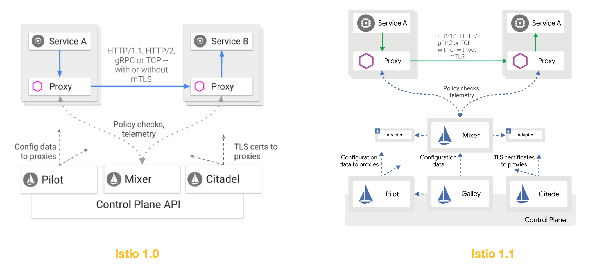

+++
title = "Istio深度解读之Mixer v2: 浪子回头金不换"

date = 2019-06-11
lastmod = 2019-06-11
draft = true

tags = ["服务网格","Istio", "Mixer"]
summary = "Istio深度解读之Mixer v2: 浪子回头金不换"
abstract = "Istio深度解读之Mixer v2: 浪子回头金不换"

[header]
image = "headers/post/201904-microservice-anti-patten.jpg"
caption = ""

+++

## 前言

社区对于 Istio 的性能的讨论和诟病由来已久，尤其 Mixer 更是 Istio 中公认的性能瓶颈所在，一向都是众矢之的。而 Mixer 性能问题的根源在于其架构设计，在两年的挣扎之后，Istio 终于拿出了颠覆性的 Mixer v2 ，虽然目前暂时还处于 review 阶段离最终发布尚早，但总算让我们看到了解决问题的一线曙光。

然而在黎明真正到来之前，我们还是不得不在黑暗中继续忍耐，为此 Istio 在 1.1版本中给出了一个不是办法的办法：默认关闭 Mixer check 功能。至于 Mixer report，可观测性是 Istio 的核心功能，无法抛弃，好在 report 有异步加批量的优化可以硬撑一段时间。

**为什么 Mixer 的性能表现会如此糟糕？ Mixer v2 又将带来什么样的解决方案？**

本文将全面剖析 Mixer 的架构和设计，解答上述问题。

## Mixer原始设计

### Istio核心架构

下图是 Istio 早期的架构图：

这个架构从2017年Istio 0.1版本基本沿用到2018年年中的 Istio1.0 版本。即使和最新的 Istio 1.1 版本相比，差别也就只有增加了 Galley 模块，和 Istio-Auth 模块改名为 Citadel。

Istio最核心的架构设计原则是：

- Envoy 组成数据平面，负责处理请求流量，完成服务间通信
- Pilot / Mixer / Auth（现在改名叫做 Citadel）组成控制平面，用来为数据平面提供信息和配置，以控制数据平面的行为

### 问题所在：抽象概念=部署模型

从逻辑概念抽象和系统架构拆分的角度看，Istio将系统分为数据平面和控制平面的想法非常自然而正确，其中 Pilot / Mixer / Citadel 的分工也没问题。

然而在抽象概念转化为实际代码和部署组件时，Istio 采取了最简单的方式：直接将抽象概念对应的组件模块等同于实际部署运行的系统组件：

- 数据平面和控制平面彻底分离
- Pilot / Mixer / Citadel 三个模块以独立进程的方式运行
- 各个组件之间通过远程调用进行通信

就有形而上学的味道：

在数据平面和控制平面分离的基本设计原则指导下，Istio

从图上可以看到：

- Mixer 是作为控制平面的一部分，以独立进程运行
- Mixer 需要和运行在数据平面的 Envoy 通信

控制平面和数据平面的通信理所当然的是通过远程网络访问来完成，Istio 中实际统一使用 gRPC 协议。因此在图上可以看到，控制平面的三个模块 Pilot / Mixer / Auth（现在改名叫做 Citadel）都和数据平面的 Envoy 有交互，或者说远程通信。

但如果细细分析这三个模块和数据平面/Envoy 的交互方式和内容，就会发现 Mixer 的特殊之处：

1. 数据交互的方向

  - Pilot 和 Citadel 都是下发数据和信息，即数据的方向是从控制平面到数据平面
  - Mixer 相反，是从数据平面向控制平面发起请求（check）或者上报信息（report）
2. 数据内容的语义

  - Pilot 和 Citadel 下发的都是控制信息，如xDS中的服务发现信息、各种路由规则、证书，非常符合控制平面语义
  - Mixer 中 check 的功能是控制语义，如黑白名单/策略控制等，但是 report 功能纯粹是数据上报和收集，完全不涉及任何的控制语义
3. 和数据平面请求流量的关系

  - Citadel 主要是证书类的信息，通常在启动和请求连接建立时有通信，和数据平面的每个请求没有直接关系，流量开始之后基本就不再发生交互
  - Pilot 主要下发的是xDS信息，同样是开始时发送，后面只有发生变更了才更新，同样是和数据平面的每个请求没有直接关系
  - Mixer check 是每个数据平面的请求都要访问一次（有缓存优化），Mixer Report 是需要上报每个请求的数据（有异步 + 批量+ 采样的优化），原则上说 Mixer 和数据平面的每个请求都有直接关系 
4. 最特殊的是，mixer check的逻辑从业务逻辑语义上，必须是每请求 + 同步阻塞模式，对数据平面的影响极大

## Mixer新版设计

## Mixer V2规划

## 总结

