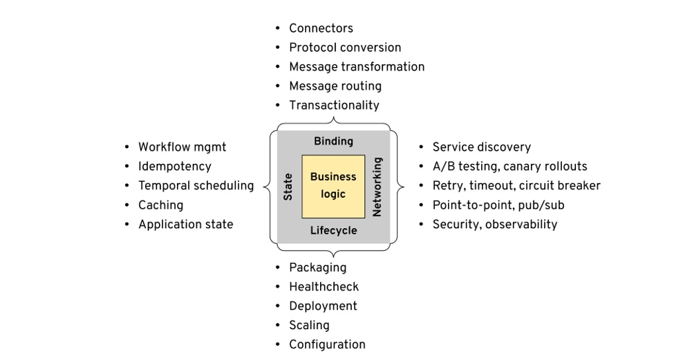
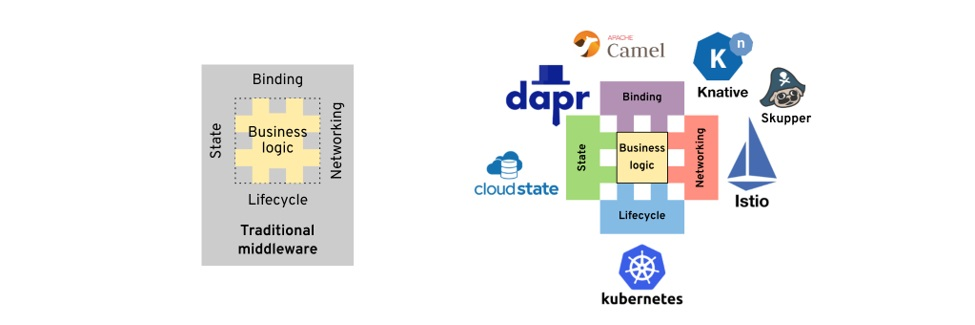
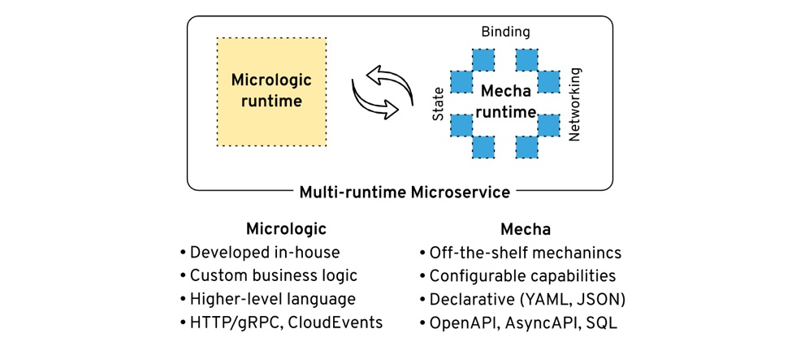
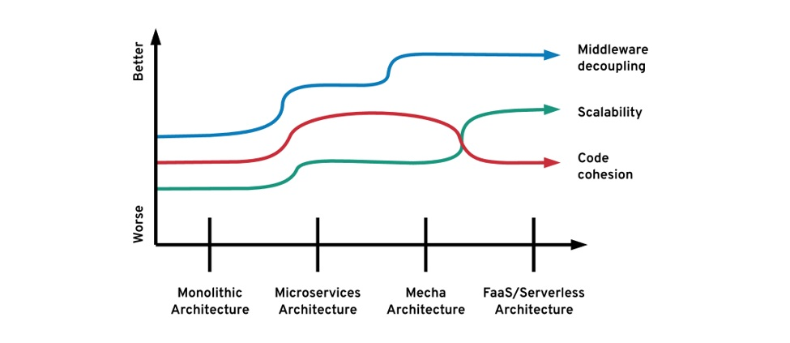

+++
title = "[译] 多运行时微服务架构"

date = 2020-03-04
lastmod = 2020-03-04
draft = false

tags = ["Istio"]
summary = "multi-runtime-microservice-architecture"
abstract = "multi-runtime-microservice-architecture"

[header]
image = "headers/post/202003-multi-runtime-microservice-architecture.jpg"
caption = ""

+++

英文原文来自 [Multi-Runtime Microservices Architecture](https://www.infoq.com/articles/multi-runtime-microservice-architecture/)，作者 [Bilgin Ibryam](http://ofbizian.com/)，由 [Daniel Bryant](https://www.infoq.com/profile/Daniel-Bryant/) 复审。 

> 备注：快速翻译（机翻+人工校对，没有精修），质量不高，一般阅读可以，不适合传播，谢绝转载。

------

## 重点

- 创建分布式系统并非易事。围绕“微服务”架构和“ 12要素应用程序”设计有很多最佳实践。提供了与交付生命周期，网络，状态管理以及绑定外部依赖有关的准则。
- 然后，始终一致地实施这些原则，尤其是以可扩展和可维护的方式，是非常具有挑战性的。
- 参照这些原理，传统的以技术为中心的方法包括企业服务总线（Enterprise Service Bus/ESB）和面向消息的中间件（Message-Oriented Middleware/MOM）。虽然这些解决方案提供了良好的功能集，但主要的挑战是单体架构以及业务逻辑和平台之间的紧密技术耦合。 
- 随着云，容器和容器编排器（Kubernetes）的流行，参照这些原理的新解决方案应运而生。例如，用于交付的Knative，用于网络的服务网格以及用于绑定和集成的Camel-K。
- 使用这种方法，业务逻辑（称为“微逻辑/micrologic”）构成了应用程序的核心，然后创建sidecar“ mecha”组件，提供强大的开箱即用（out-of-the-box）的分布式原语。 
- 微逻辑（micrologic）组件和机制（mecha）组件的解耦可以改善运维，例如打补丁和升级，并有助于维持业务逻辑内聚单元的长期可维护性。

------

创建良好的分布式应用程序并非易事：此类系统通常遵循12要素应用和微服务原则。它们必须是无状态的，可伸缩的，可配置的，独立发布的，容器化的，可自动化的，并且有时是事件驱动的和serverless的。创建后，它们应该易于升级，并且长期可维护的。在当今的技术中，要在这些相互竞争的要求之间找到良好的平衡仍然是一项艰巨的努力。

在本文中，我将探讨分布式平台如何发展以实现这种平衡，更重要的是，在分布式系统的发展中还需要哪些东西，以简化可维护的分布式体系架构的创建。如果您想看到我实时谈论这个话题，请加入我三月的 [QCon](https://qconlondon.com/london2020/presentation/kubernetes-and-cloud-architectures-1) 伦敦。

## 分布式应用的需求

在此讨论中，我将把现代分布式应用的需求分为四种类型（生命周期，网络，状态，绑定）并简要分析它们在最近几年中的发展情况。

（图：分布式应用程序需求）

### 生命周期（Lifecycle）

让我们从基础开始。当我们编写功能时，编程语言会指定生态系统中的可用库，打包格式和运行时。例如，Java使用.jar格式，用作生态系统的所有Maven依赖项，还有JVM用作运行时。如今，随着发布周期的缩短，生命周期中更重要的是自动化能力：能够部署，从错误中恢复以及扩展服务。这组功能广泛地代表了我们的应用生命周期需求。

### 网络（Networking）

从某种意义上讲，今天几乎每个应用都是分布式应用，因此需要网络。但是现代分布式系统需要从更广泛的角度掌握网络。从服务发现和错误恢复开始，到启用现代软件发布技术，以及各种跟踪和遥测。为了我们的目的，我们甚至将不同的消息交换模式，点对点和发布/订阅方法，以及智能路由机制包括在此类别中。

### 状态（State）

当我们谈论状态时，通常是关于服务状态以及为什么最好是无状态的。但是管理我们服务的平台本身是需要状态的。这是执行可靠的服务编排和工作流，分布式单例，临时调度（cron作业），幂等，有状态错误恢复，缓存等所需的。这里列出的所有功能都依赖于底层的状态。尽管实际的状态管理不在本文讨论范围之内，但依赖状态的分布式原语及其抽象却令人关注。

### 捆绑（Binding）

分布式系统的组件不仅必须彼此对话，而且还必须与现代或旧式外部系统集成。这就要求连接器能够转换各种协议，支持不同的消息交换模式，例如轮询，事件驱动，请求/答复，转换消息格式，甚至能够执行自定义错误恢复过程和安全机制。

在不涉及一次性使用案例的情况下，以上内容代表了创建良好的分布式系统所需的通用原语的良好集合。今天，许多平台都提供了这样的功能，但是我们在本文中探寻的是过去十年中我们使用这些功能的方式是如何变化的，以及在下一个十年中它将如何变化。为了进行比较，让我们看一下过去的十年，看看基于Java的中间件如何满足这些需求。

## 传统中间件限制

在满足上述需求的上一代传统解决方案，众所周知的是企业服务总线（ESB）及其变体（例如面向消息的中间件，更轻量级的集成框架等）。ESB是一种中间件，可以使用面向服务的架构（即经典SOA）在异构环境之间实现互操作性。

虽然ESB将为您提供良好的功能集，但ESB的主要挑战是单体架构以及业务逻辑和平台之间紧密的技术耦合，从而导致了技术和组织的中心化。开发并部署服务到这样的系统中时，与分布式系统框架紧密耦合，从而限制了服务的发展。这通常只会在软件生命周期的后期才变得明显。

以下是每种需求的问题和局限性，这些导致ESB在现在不再有用。

### 生命周期（Lifecycle）

在传统的中间件中，通常只有一个受支持的语言运行时（例如Java），它规定了软件的打包方式，可用的库，需要修补的频率等。业务服务必须使用这些库。使其与以相同语言编写的平台紧密结合。实际上，这导致服务和平台升级被关联起来，从而阻止了独立和常规的服务和平台发布。

### 网络（Networking）

尽管传统中间件也具有围绕与其他内部和外部服务交互的高级功能集，但它有一些主要缺点。网络功能集中于一种主要语言及其相关技术。对于Java语言，即JMS，JDBC，JTA等。更重要的是，网络问题和语义也深深地刻在业务服务中。有一些具有抽象的库来处理网络问题（例如曾经很受欢迎的Hystrix项目），但是该库的抽象也“泄漏”到了服务的编程模型，交换模式和错误处理语义以及库本身中。虽然可以方便地在一个位置编写和读取与网络方面混合的整个业务逻辑，但是这将两个问题紧密地耦合到实现中，最终形成了共同的演进路径。

### 状态（State）

为了进行可靠的服务编排，业务流程管理以及实现模式（例如Saga模式和其他运行缓慢的流程），平台需要在幕后持久化状态。同样，临时动作（例如触发计时器和cron作业）建立在状态之上，并且需要在分布式环境中对数据库进行集群和恢复。这里的主要约束是以下事实：与状态交互的库和接口没有完全抽象出来，也没有与服务运行时解耦。通常，这些库必须配置有数据库详细信息，并且它们存在于服务中，从而将语义和依赖关系泄漏到应用域中。

### 绑定（Binding）

使用集成中间件的主要驱动力之一是能够使用不同的协议，数据格式和消息交换模式连接到其他各种系统。但是，这些连接器必须与应用程序一起使用，这意味着必须将依赖关系与业务逻辑一起更新和修补。这意味着必须在服务中来回转换数据类型和数据格式。这意味着必须根据消息交换模式来构造代码并设计流程。即使是抽象的端点也会影响传统中间件中的服务实现，有很多这方面的例子。

## 云原生趋势

传统的中间件功能强大。它具有所有必要的技术功能，但缺乏现代数字业务需求所要求的快速更改和扩展的能力。这就是微服务架构及其设计现代分布式应用的指导原则所要解决的问题。

微服务背后的思想及其技术要求促进了容器和Kubernetes的普及和广泛使用。这开始了一种新的创新方式，这种方式将影响我们今后几年处理分布式应用程序的方式。让我们看看Kubernetes和相关技术如何影响每种需求。

### 生命周期（Lifecycle）

容器和Kubernetes将打包，分发和部署应用的方式发展为与语言无关的格式。关于[Kubernetes模式](http://k8spatterns.io/)和[Kubernetes影响](https://www.infoq.com/articles/kubernetes-effect)开发人员的文章有很多，在这里我将简短介绍。但是请注意，对于Kubernetes，要管理的最小原语是容器，它专注于在容器级别和流程模型上交付分布式原语。这意味着它在管理应用的生命周期，健康检查，恢复，部署和扩展方面做得很出色，但是在容器内的分布式应用的其他方面却没有做得很好，例如灵活的网络，状态管理和绑定。

您可能会指出，Kubernetes具有有状态工作负载，服务发现，cron作业和其他功能。的确如此，但是所有这些原语都是在容器级别的，并且在容器内部，开发人员仍然必须使用特定于语言的库来访问我们在本文开头列出的更详细的功能。这就是推动诸如Envoy，Linkerd，Consul，Knative，Dapr，Camel-K等项目的原因。

### 网络（Networking）

事实证明，Kubernetes提供的围绕服务发现的基本网络功能是一个很好的基础，但对于现代应用来说还不够。随着微服务数量的增加和部署速度的加快，在不改动服务的情况下，对更高级的发布策略，管理安全性，指标，跟踪，从错误中恢复，模拟错误等等方面的需求变得越来越具有吸引力，并产生了一种新的软件类别，称为服务网格。

这里更令人兴奋的是，趋势是将与网络相关的问题从包含业务逻辑的服务中移出，放到单独的运行时（无论是sidecar还是节点级代理）。如今，服务网格可以执行高级路由，帮助测试，处理某些方面的安全性，甚至可以使用特定于应用的协议（例如，Envoy支持Kafka，MongoDB，Redis，MySQL等）。尽管服务网格作为一种解决方案可能尚未得到广泛采用，但它触及了分布式系统中的真正痛点，我相信它将找到其形状和存在形式。

除了典型的服务网格外，还有其他项目，例如[Skupper](https://skupper.io/)，这些项目证实了将网络功能放入外部运行时代理的趋势。Skupper通过7层虚拟网络解决了多集群通信难题，并提供了高级的路由和连接能力。但是，它没有将Skupper嵌入到业务服务运行时中，而是在每个Kubernetes命名空间中运行一个实例，该实例充当共享的Sidecar。

综上所述，容器和Kubernetes在应用生命周期管理方面迈出了重要的一步。服务网格和相关技术遇到了真正的痛点，并为将更多职责从应用程序移到代理中奠定了基础。让我们看看下一步。

### 状态（State）

我们在前面列出了依赖状态的主要集成原语。管理状态非常困难，应将其委派给专门的存储软件和托管服务。这不是今天的主题，而是在语言无关的抽象中使用状态来帮助集成的用例。今天，许多努力试图在语言无关的抽象后面提供有状态的原语。有状态的工作流管理是基于云的服务中的强制性功能，例如AWS Step Functions，Azure Durable Functions等示例。在基于容器的部署中，[CloudState](https://github.com/cloudstateio/cloudstate)和[Dapr](https://dapr.io/)都依赖于sidecar模型来提供对分布式应用的状态抽象的更好的解耦。

我也期待将上面列出的所有有状态功能抽象到一个单独的运行时中。这意味着工作流管理，单例，幂等，事务管理，cron作业触发器和有状态错误处理都可靠地发生在Sidecar（或主机级代理）中，而不是存在于服务中。业务逻辑不需要在应用中包含此类依赖关系和语义，并且可以从绑定环境中声明性地请求此类行为。例如，Sidecar可以充当cron作业触发器，幂等消费者和工作流管理器，而自定义业务逻辑可以作为回调调用或作为某些阶段插入到工作流，错误处理，临时调用或唯一幂等需求中。

另一个有状态用例是缓存。无论是通过服务网格层执行请求缓存，还是使用Infinispan，Redis，Hazelcast等之类的数据缓存，都有一些将缓存功能推到应用运行时之外的[示例](https://dzone.com/articles/where-is-my-cache-architectural-patterns-for-cachi)。

### 绑定（Binding）

尽管我们的主题是将所有分布式需求与应用运行时解耦，但这种趋势也伴随着绑定。连接器，协议转换，消息转换，错误处理和安全中介都可以移出服务运行时。我们还没有到那里，但是在诸如[Knative](https://cloud.google.com/knative/)和Dapr之类的项目中已经在朝这个方向进行尝试。将所有这些职责移出应用运行时将导致更小，更专注于业务逻辑的代码。这样的代码将在运行时中运行，运行时独立于分布式系统需求，而分布式系统需求可以作为预先打包好的功能使用。

Apache [Camel-K](https://camel.apache.org/camel-k/latest/index.html)项目采用了另一种有趣的方法。该项目没有使用代理运行时来伴随主应用，而是依靠智能的Kubernetes Operator，用Operator来构建具有Kubernetes和Knative的附加平台功能的应用运行时。在这里，单个代理是Operator，负责包含应用所需的分布式系统原语。不同之处在于，某些分布式原语已添加到应用运行时中，而某些在平台中启用（也可能包括Sidecar）。

## 未来架构趋势

概括地说，我们可以得出结论，通过将功能部件转移到平台级别，分布式应用的商品化达到了新的高度。除了生命周期之外，现在我们还可以观察到网络，状态抽象，声明性事件和端点绑定（现成可用），还有随后的 EIP（译者注：EIP应该是Enterprise Integration Patterns/企业集成模式）。有趣的是，商品化使用进程外模型（sidecar）进行功能扩展，而不是使用运行时库或纯平台功能（例如新的Kubernetes功能）。

现在，我们正在通过将所有传统的中间件功能（如ESB）移至其他运行时来全面发展，不久之后，我们在服务中要做的就只是编写业务逻辑。

（图：传统中间件平台和云原生平台概述）

与传统的ESB时代相比，这个架构更好的解耦了业务逻辑和平台，但是还没有完全分离。许多分布式原语，如经典的企业集成模式（enterprise integration patterns/EIP）：拆分器，聚合器，过滤器，基于内容的路由器；流处理模式：映射，过滤，折叠，联接，合并，滑动窗口；仍然必须包含在业务逻辑的运行时中，还有许多其他的东西依赖于多个不同且重叠的平台附加组件。

如果我们把不同领域进行创新的各种云原生项目进行叠加，那么最终将得到下图：

（图：多运行时微服务）

上图仅用于说明，它有目的地选择了代表性的项目并将其映射到分布式原语的分类。实际上，您不会同时使用所有这些项目，因为其中一些项目是重叠的，且工作负载模型不兼容。如何解释这个图？

- Kubernetes和容器在多语言应用的生命周期管理中取得了巨大飞跃，并为未来的创新奠定基础。
- 服务网格技术通过高级网络功能在Kubernetes上进行了改进，并开始涉足应用方面。
- 尽管Knative通过快速扩展主要专注于serverless工作负载，但它也满足了服务编排和事件驱动的绑定需求。
- Dapr以Kubernetes，Knative和Service Mesh的思想为基础，并深入应用运行时以解决有状态的工作负载，绑定和集成需求，充当现代化分布式中间件。

该图可帮助您直观地看到，很可能在将来，我们最终将使用多个运行时来实现分布式系统。多个运行时，不是因为有多个微服务，而是因为每个微服务都将由多个运行时组成，最有可能是两个运行时-自定义业务逻辑运行时和分布式原语运行时。

## 引入多运行时微服务

这是正在形成的多运行时微服务架构的简要说明。

您还记得电影《阿凡达》和科学家们制作的用于去野外探索潘多拉的 Amplified Mobility Platform (AMP)“机车服”吗？这个多运行时架构类似于这些 [Mecha](https://en.wikipedia.org/wiki/Mecha)-套装，为类人驾驶员赋予超能力。在电影中，您要穿上套装才能获得力量并获得破坏性武器。在这个软件架构中，您将拥有构成应用核心的业务逻辑（称为微逻辑/micrologic）和提供强大的开箱即用的分布式原语的sidecar mecha组件。Micrologic与mecha功能相结合，形成多运行时微服务，该服务将进程外功能用于其分布式系统需求。最棒的是，Avatar 2即将面世，以帮助推广这种架构。我们最终可以在所有软件会议上用令人赞叹的机甲图片代替老式的边车摩托车；-)。接下来，让我们看看该软件架构的详细信息。

这是一个类似于客户端-服务器体系结构的双组件模型，其中每个组件都是独立的运行时。它与纯客户端-服务器架构的不同之处在于，这两个组件都位于同一主机上，彼此之间有可靠的网络连接。这两个组件的重要性相当，它们可以在任一方向上发起操作并充当客户端或服务器。其中的一个组件称为Micrologic，拥有非常少的业务逻辑，把几乎所有分布式系统问题都剥离出去了。另一个伴随的组件是Mecha，提供了我们在本文中一直讨论的所有分布式系统功能（生命周期除外，它是平台功能）。

（图：多运行时（进程外）微服务架构）

Micrologic 和 Mecha 可以是一对一部署（称为sidecar模型），也可以是多个Micrologic运行时共享一个Mecha。第一种模型最适用于Kubernetes等环境，而后者适用于边缘部署。

### Micrologic运行时特征

让我们简要地探讨Micrologic运行时的一些特征：

- Micrologic组件本身不是微服务。它包含微服务将具有的业务逻辑，但是该逻辑只能与Mecha组件结合使用。另一方面，微服务是自包含的，不会把整体功能的一部分或者一部分处理流程扩展到其他运行时中。Micrologic和Mecha的组合形成微服务。
- 这也不是 function 或 serverless 架构。Serverless中最著名的是其托管的快速扩展和收缩到零的功能。在serverless架构中，function 实现单个操作，作为可伸缩性的单位。在这方面，function 不同于实现多种操作的Micrologic，但实现方式不是端到端的。最重要的是，操作的实现分布在Mecha和Micrologic运行时上。
- 这是客户端-服务器架构的一种特殊形式，针对无需编码即可使用的众所周知的分布式原语进行了优化。另外，如果我们假设Mecha扮演服务器角色，那么每个实例都必须经过专门配置以便和单个客户端一起工作。它不是典型的客户端-服务器架构中的通用服务器实例，这种服务器实例旨在同时支持多个客户端。
- Micrologic中的用户代码不会直接与其他系统交互，也不会实现任何分布式系统原语。它通过事实上的标准（例如HTTP/gRPC，[CloudEvents](https://github.com/cloudevents)规范）与Mecha进行交互，而Mecha使用丰富的功能与其他系统进行通信，通讯是在配置的步骤和机制的指导下进行。
- 尽管Micrologic仅负责实现从分布式系统问题中剥离出来的业务逻辑，但它仍必须至少实现一些API。它必须允许Mecha和平台通过预定义的API和协议与其进行交互（例如，通过遵循Kubernetes部署的云原生[设计原则](https://www.redhat.com/en/resources/cloud-native-container-design-whitepaper)）。

### Mecha运行时特征

以下是一些Mecha运行时特征：

- Mecha是一个通用的，高度可配置的，可重用的组件，提供分布式原语作为现成的能力。
- Mecha的每个实例都必须配置为与单个Micrologic组件一起使用（边车模型），或者配置为与几个组件共享。
- Mecha不对Micrologic运行时做任何假设。它与使用开放协议和格式（例如HTTP/gRPC，JSON，Protobuf，CloudEvents）的多语言微服务甚至单体系统一起使用。
- Mecha以简单的文本格式（例如YAML，JSON）声明式地配置，指示要启用的功能以及如何将其绑定到Micrologic端点。对于特定的API交互，可以为Mechan附加规范，例如[OpenAPI](https://github.com/OAI/OpenAPI-Specification)，[AsyncAPI](https://github.com/asyncapi/asyncapi)，ANSI-SQL等。对于由多个处理步骤组成的有状态工作流，可以使用诸如 [Amazon State Language](https://states-language.net/spec.html) 的规范。对于无状态集成，可以使用与 [Camel-K YAML DSL](https://github.com/apache/camel-k-runtime/tree/master/camel-k-loader-yaml) 类似的方法来使用企业集成模式（[EIP](https://www.enterpriseintegrationpatterns.com/)）。这里的关键点是，所有这些都是简单的，基于文本的，声明性的，多语言的定义，Mecha无需编码即可实现。请注意，这些都是未来派的预测，目前，尚无用于有状态编排或EIP的Mechas，但我希望现有的Mechas（Envoy，Dapr，Cloudstate等）很快就会开始添加此类功能。Mecha是应用级的分布式原语抽象层。
- 与其依靠多个代理来实现不同的目的（例如网络代理，缓存代理，绑定代理），不如使用一个Mecha提供所有这些能力。一些功能（例如存储，消息持久化，缓存等）的实现将被其他云或本地服务插入并支持。
- 某些与生命周期管理有关的分布式系统问题可以由管理平台（例如Kubernetes或其他云服务）提供 ，而不是使用诸如 [Open App Model](https://github.com/oam-dev/spec) 这样的通用开放规范的Mecha运行时提供。

### 这种架构的主要好处是什么？

好处是业务逻辑和越来越多的分布式系统问题之间的松耦合。软件系统的这两个要素具有完全不同的动态。业务逻辑始终是内部编写的唯一的自定义代码。它经常更改，具体取决于组织优先级和执行能力。另一方面，分布式原语是用来解决这篇文章中列出的问题的那些众所周知的内容。这些由软件供应商开发，并作为库，容器或服务使用。该代码根据供应商的优先级，发布周期，安全补丁，开放源代码管理规则等而更改。这两个组之间几乎不可见并且无法相互控制。

（图：业务逻辑和分布式系统问题在不同架构中的耦合）

微服务原理有助于通过有边界的上下文解耦不同的业务领域，每个微服务都可以独立发展。但是微服务架构无法解决业务逻辑与中间件问题耦合在一起带来的困难。对于某些轻度集成用例的微服务，这可能不是一个大因素。但是，如果您的领域涉及复杂的集成（情况越来越普遍），那么遵循微服务原则也无法帮助避免与中间件的耦合。即使中间件表现为包含在微服务中的类库，当您开始迁移和更改这些库时，这种耦合也将显而易见。还有需要的分布式原语越多，与集成平台的耦合就越多。通过预定义的API将中间件作为独立运行时/进程来使用（而不是类库），有助于松散耦合并实现每个组件的独立演化。

对于供应商来说，这也是分发和维护复杂的中间件软件的更好方法。只要与中间件的交互是通过开放API和标准的进程间通信进行的，软件供应商就可以按照自己的节奏自由发布补丁和升级。消费者可以自由使用他们喜欢的语言，类库，运行时，部署方法和过程。

### 这种架构的主要缺点是什么？

**进程间通信**。分布式系统的业务逻辑和中间件机制（您可以看到名称的来源）在不同的运行时中，并且需要HTTP或gRPC调用而不是进程内方法调用。但是请注意，这不是转到其他计算机或数据中心的网络调用。Micrologic运行时和Mecha应该部署在同一主机上，以获得较低的延迟，还有最小化网络出问题的可能性。

**复杂度**。下一个问题是，为了获得的收益，开发和维护此类系统的复杂度是否值得。我认为答案将越来越倾向于“是”。分布式系统的需求和发布周期的步伐正在增加。而此架构为此进行了优化。我前段时间写道，未来的开发人员必须具备[混合开发技能](https://www.infoq.com/articles/microservices-post-kubernetes)。这种架构进一步证实和加强了这一趋势。应用程序的一部分将使用高级编程语言编写，另一部分功能将由现成的组件提供，必须通过声明式配置。两个部分的互连不是在编译时，或在启动时通过进程内依赖注入，而是在部署时通过进程间通信。此模型可以实现更高的软件重用率和更快的变更速度。

### 微服务而不是Function带来的是什么？

微服务架构有一个明确的目标。它为变化而优化。通过将应用按照业务域拆分，这个架构通过解耦的，由独立团队进行管理和单独发布的服务，为软件的演进和可维护性提供了最佳的服务边界。

让我们看一下 serverless 架构的编程模型，它主要基于 function。Function 针对可伸缩性进行了优化。通过 Function，我们将每个操作分解到一个独立的组件，以便可以快速、独立和按需扩展。在此模型中，部署粒度是 function。之所以选择 function，是因为它的代码结构：其输入的速率与缩放行为直接相关。这种架构针对极端可伸缩性进行优化，而不是复杂系统的长期可维护性。

从AWS Lambda的流行和它完全托管的运维性质来看，Serverless的其他方面又如何呢？在这方面，“ AWS Serverless”为配置速度进行了优化，但缺少控制和锁定功能。但是完全托管不是应用架构，而是软件使用模型。它在功能上是正交的，类似于使用基于SaaS的平台，该平台在理想情况下应适用于任何类型的架构，无论是单体，微服务，mecha还是 Function。在许多方面，AWS Lambda类似于完全托管的Mecha架构，但有一个很大的区别：Mecha不强求 function 模型，而是允许围绕业务域使用更具凝聚力的代码构造，而剥离所有的中间件。

(图：架构优化)

另一方面，Mecha架构针对中间件独立性优化了微服务。微服务尽管彼此独立，但它们在很大程度上依赖于侵入式分布式原语。Mecha架构将这两个问题分为单独的运行时，从而允许独立团队独立发布它们。这种解耦可以改善 day-2 的运维（例如打补丁和升级），并改善业务逻辑内聚单元的长期可维护性。从这个角度说，Mecha架构是微服务架构的自然演进，它基于引起最大摩擦的边界拆分软件。与function模型相比，该优化以软件重用和演进的形式提供了更多的好处，而 function 模型则为极致的可伸缩性而优化，代价就是代码的过度分布。

## 总结

分布式应用程序有许多需求。创建有效的分布式系统需要多种技术和良好的集成方式。尽管传统的单体中间件提供了分布式系统所需的所有必要技术能力，但它却缺乏业务需要的快速更改，适应和扩展所需的能力。基于微服务的架构背后的思想为容器和Kubernetes的快速普及做出了贡献。随着云原生领域的最新发展，我们现在通过将所有传统中间件功能转移到平台和现成的辅助运行时中来全面发展。

应用功能的这种商品化主要是使用进程外模型进行功能扩展，而不是运行时类库或纯平台功能。这意味着将来很有可能我们将使用多个运行时来实现分布式系统。多个运行时，不是因为有多个微服务，而是因为每个微服务由多个运行时组成：一个用于自定义微业务逻辑的运行时，以及一个用于分布式原语的现成的可配置运行时。

## 作者介绍

**Bilgin Ibryam** 是Red Hat的首席架构师，Apache Software Foundation 的 committer 和成员。他是一个开源的布道师，博客作者，偶尔的演讲者，并且是书籍 Kubernetes Patterns 和 Camel Design Patterns 的作者。在日常工作中，Bilgin乐于指导，编码并带领开发人员成功构建开源解决方案。他目前的工作集中在区块链，分布式系统，微服务，devop和云原生应用开发。