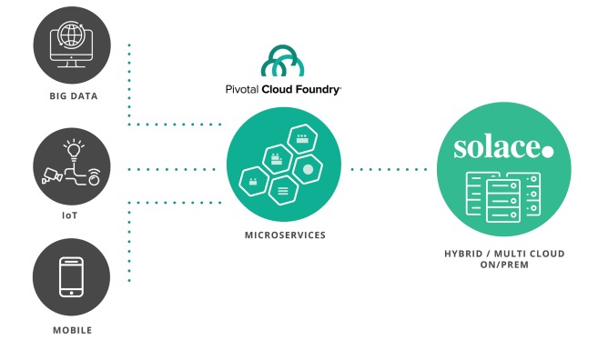
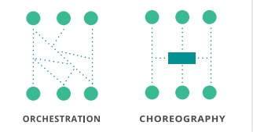

+++
title = "[译] 事件驱动微服务架构师指南"

date = 2020-04-02
lastmod = 2020-04-02
draft = false

tags = ["EDA"]
summary = "将事件驱动架构和微服务结合在一起会带来巨大的好处，事件/消息才是最能处理分布式计算的特异性，是释放微服务架构潜力的关键。"
abstract = "将事件驱动架构和微服务结合在一起会带来巨大的好处，事件/消息才是最能处理分布式计算的特异性，是释放微服务架构潜力的关键。"

[header]
image = "headers/post/202004-event-driven-microservices.jpg"
caption = ""

+++

英文原文来自Solace公司网站上的一份PDF格式的小册子: [The Architect’s Guide to Event-Driven Microservices](https://go.solace.com/wp-download-eventdrivenmicroservices.html) ，副标题为 "The Architect’s Guide to Building a Responsive, Elastic and Resilient Microservices Architecture / 架构师指南，用于建立响应式的，灵活而弹性的微服务架构。"

------

## 前言

> If we are to exponentially increase agility through microservices, we need to replace our static, stove-piped, monolithic thinking.
>
> 如果我们要通过微服务来指数级地提高敏捷性，我们需要取代静态的、炉火纯青的、单体化的思维。
>
> By JONATHAN SCHABOWSKY

## 简介

许多组织迁移到微服务架构，原因只有一个：敏捷性。在有大量竞争者，而上市时间就是一切的世界里，能够快速创建和修改组件的能力是至关重要的。但开发组件的速度只是其中的一块拼图而已。

如何快速地将它们与你的系统的其他部分集成？你接受创新的技术新事物有多彻底？为了使您的微服务计划能够成功，您的组织必须认识到敏捷取决于全面的利用诸如CI/ CD，自动化基础设施，DevOps和敏捷开发。一般的微服务架构师结合这些融入精益求精的发展理念。一个优秀的微服务架构师不会止步于此，还包括欣赏和探讨如何克服不可否认的问题 - 高度分布式系统中的可预见的陷阱 。

确保微服务计划成功的关键在于了解敏捷性的显著风险或障碍。

- 分布式处理的脆弱性
- 生态系统集成的挑战；以及
- 服务和谐性的缺乏

如果我们不尊重分布式系统的现实，我们将重复过去的失败，就像2000年代的SOA炒作一样。幸运的是，有一种真正强大的方法可以弥补这些现实：事件驱动（也叫反应式/reactive）架构。

Jonathan Schabowsky，Solace CTO办公室的高级架构师，将解释把事件驱动架构和微服务结合在一起的巨大好处，首先应用的分解虽然在很多方面都有好处，但会让事情变得更复杂一些。

> Application leaders engaged in digital transformation initiatives must add ‘event thinking’ to their technical, organizational and cultural strategies.
> 
> 参与数字化转型计划的应用领导者必须在其技术、组织和文化战略中加入 "事件思维"。
> 
> YEFIM NATIS
> GARTNER

## 服务分解悖论 

微服务的理论很简单：通过将单体的应用分解成小的、特定用途的微服务，实现更好的敏捷性、可扩展性和可重用性。

现实世界中的微服务实现一如既往地比这复杂。在很大程度上是因为分布式计算的谬误--程序员和架构师在进入分布式应用的世界时，都会做出一系列错误的假设。这个列表是由 Sun Microsystems 公司的 L. Peter Deutsch 和其他人在1994年写的，但它在今天仍然适用。

- **The network is reliable / 网络是可靠的**
- **Latency is zero / 延迟为零**
- Bandwidth is infnite / 带宽无限
- **The network is secure / 网络是安全的**
- Topology doesn’t change / 拓扑结构不会改变
- There is one administrator / 有一个管理员
- **Transport cost is zero / 传输成本为零**
- **The network is homogeneous / 网络是同质化的**

虽然所有这些谬误都是相关的，但粗体字的谬误对于微服务世界来说特别重要。把每个微服务做得越小，服务数量越大，分布式计算的谬误就越影响稳定性和用户体验/系统性能。这使得建立架构和实现变得至关重要：既能最大限度地减少延迟，又能处理网络和服务中断的现实。

大部分与微服务相关的工具工具都涉及到CI/CD、自动化基础设施、DevOps和敏捷软件开发。Pivotal Cloud Foundry就是一个很好的例子，它为开发人员提供了一种使用现代云原生技术创建、测试、部署和更新微服务的简便方法。

挑战在于，微服务需要连接/数据才能发挥其作用并提供业务价值，而数据采集/通信在很大程度上被忽略了，以至于工具化严重滞后。例如，API管理/网关产品只支持同步、请求/回复的交换模式，这加剧了分布式计算的挑战。而且它们不具备与遗留系统集成或获取数据的能力。

同时，事件/消息工具也一直停留在过时的、非agile的世界里，与微服务的许多指导原则如 DevOps 和 selfservice 不兼容。但是，事件/消息才是最能处理分布式计算的特异性，也是释放微服务架构潜力的关键。

> “Eventing/messaging tools have been stuck in the antiquated, non-agile world. Many are incompatible with the guiding principles of microservices, such as DevOps.”
>
> "事件/消息工具一直停留在陈旧的、非agile的世界里。许多工具都与微服务的指导原则不相容，比如DevOps。"

随着服务的规模越来越小，目的越来越单一，复用的可能性也就越来越大，但这是以服务的协作能力为前提的。

在SOA时代，会创建大量的单体服务，直接实现用例的所有方面，如一组使用BPEL引擎或ESB编排的服务。它们不能重复使用，难以扩大规模，因为 ESB / BPEL 编排将太多的逻辑移进入网络，导致 "哑巴端点和智能管道（dumb endpoints and smart pipes）"，昂贵、复杂，几乎不可能排除故障。

今天，我们认识到，要走的路是小型、单一用途的微服务，和用"智能终端哑巴管道（smart endpoints, dumb pipes） "的方式来进行连接和通信。但是， 有个问题一直困扰着我们。

在增加商业价值的情况下，我们如何才能实现服务协作，而不回归到那些失败的单体或编排技术？

## 集成的难题

因为所有的微服务都需要数据来处理，而既然12要素应用是无状态的，那么数据需要从哪里来。为 greenfield 的系统获取数据是很容易，但微服务几乎总是作为数字化转型、现代化或需要以更快的速度构建新功能的副作用而出现。因此，你几乎总是在处理一个由遗留系统组成的生态系统；有些系统将被现代化，有些系统将在可预见的未来保持原样。

现有的商业生态体系是 负担，是大多数 企业在进行 开始他们的微服务之旅。大多数 现有系统在房地内运行，而 微服务活在私人和公共 云。数据传输的能力。往往是一个不稳定和不可预知的世界，在这个世界上，我们的工作是不稳定的。广域网(WAN)是棘手的，也是很难的。耗费时间。那么，我们需要考虑到 的出现和专业化 物联网、移动设备和大数据造成的。这些系统的数量和种类 导致了很大的前期风险，对 微服务举措。

大多数企业开始微服务之旅时，现有业务生态系统是必须应对的不可避免的负担。现有的大多数系统都位于本地，而微服务则位于私有云和公共云中。 在通常不稳定且不可预测的广域网（WAN）世界中数据传输是非常棘手且耗时。 然后，我们需要考虑物联网，移动设备和大数据的出现和专业化。 这些系统的数量和多样性给微服务计划带来很大的前期风险。

当你把它加起来的时候，到处都是阻抗不匹配。1. 传统系统的更新速度很慢，但微服务需要快速、敏捷；2.传统系统使用旧的通信介质，但微服务使用现代开放的协议和API；3.传统系统几乎都在本地，充其量是使用虚拟化，但微服务依赖云和IaaS抽象；4. 物联网系统使用高度专业化的协议，但大多数微服务API和框架并不原生支持；5、移动设备可能使用REST，但也需要异步通信，但大多数API网关只支持同步RESTful交互。组织如何解决所有这些不匹配的问题？

## 舞动的微服务

正如我前面所描述的，服务越小，它对终端用户的价值越小--价值来自于编排（Orchestration）。历史上，编排是由BPEL引擎或ESB等中心组件来处理的，或者现在的API网关。

我将用一个音乐类比来解释这种方法的问题。

大多数作曲家通过试验和错误创造音乐（就像软件开发者一样）。他们的输出是什么？乐谱包含了每一种乐器都会演奏的音乐。对于这个比喻，每个演奏者就像一个微服务。如果作曲家是为一个重金属乐队创作，那么只有几件乐器（吉他、贝斯手、鼓手、声乐手），不需要指挥。

但一个交响乐团由一百名左右的演奏者组成，演奏各种乐器。在这种情况下，他们绝对需要一个指挥家，以确保每个演奏者在正确的时刻开始演奏，保持节拍，必要时加快或减慢速度，演奏的声音或大或小。

不幸的是，如果指挥家不能与演奏者沟通，甚至只是一个部分或一个演奏者的沟通，那么事情就会很快就会分崩离析，演出就会受到影响，甚至被破坏。

舞蹈就不同了。舞蹈编导听了一首歌，然后根据音乐中的事件创造出一个套路。舞者可能会做完全不同的动作或舞步，但只要是根据这些声音提示（或事件）一起协调（choreograph）的，那么这个舞步就是成功的。即使有人踏错了舞步或失去了节拍，表演也可以继续进行，因为每个舞者都是在听着为他们的特定事件而协调（choreograph）的音乐，而不是由编排者告诉他们该做什么。

回到微服务，给定的微服务会在代码中执行一系列的步骤，这就是微编排的例子。微服务的输入或输出是数据事件，这个数据事件具有领域意义。关键在于，由于微服务只是产生事件，所以它并不知道这个事件是否会被处理或何时处理。其他服务会对一个事件或一组事件进行注册并做出相应的反应。就像一个舞者在执行套路的舞步一样。具有讽刺意味的是，微服务执行和舞蹈动作之间的共同驱动因素是事件（数据事件或音频事件）。

### 事件的哥白尼转变

> FROM DATA-CENTRIC TO EVENT-CENTRIC IT PRIORITY – A COPERNICAN SHIFT
>
> 从以数据为中心到以事件为中心的IT优先级----哥白尼的转变


> “Similar to the mistakes that astronomers made before Copernicus, many architects and technologists are obsessed with the idea that data is the center of the computing universe.” 
>
> "与哥白尼之前的天文学家所犯的错误类似，很多架构师和技术专家都迷恋于数据是计算宇宙的中心的想法。" 

哥白尼是文艺复兴时期的数学家和天文学家，他提出了一个宇宙模型，将太阳而不是地球置于宇宙中心。改变了当时的游戏规则。

与哥白尼之前的天文学家所犯的错误类似，许多架构师和技术专家都执着于认为数据是计算机宇宙的中心。这种传统的观点是基于这样的信念：数据是工作。一旦数据被保存下来，就会通过命令式的请求/响应交互来查看、更新和删除。

这种对数据的极端关注的原因很简单：所有与数据库的交互都是通过命令式的交互来完成的! 这种观点的问题在于，企业最终以数据库为核心做了一堆微服务，导致很多烟囱式的应用飞地，无法快速、灵活地共享数据。换句话说，花钱创造了一种不同类型的单体应用，这种单体应用注定会同样遭遇缺乏敏捷性的命运。

那么什么应该是微服务宇宙的中心？很简单：事件。



如果我们要通过微服务成倍地提高敏捷性 ，我们需要将我们静态的，根深蒂固的单体思维替代为渴望在正确的时间将正确的事件带到正确的服务。考虑到你自己的身体。我们根据我们的触觉，视觉，味觉，听觉和气味不断地反应和行动。该事件的中继信息储存在我们的记忆中，在我们的大脑中重播，并在必要时采取某种行动，对这些信息产生作用，从而为我们的宇宙做出反应。

以事件驱动的方式思考，将组织变成了计算机宇宙中的感知元素。由Web/移动应用、IoT传感器或遗留的记录系统感知到的新事件被转发到事件/消息平台，然后分发到微服务平台。就像我们的感觉系统是如何将事件传到中枢神经系统进行解读一样。在微服务的世界里，我们需要一个中枢神经系统，它可以：

- 能够接受不同的刺激
- 提供快速、可靠的运输方式
- 适应时间接收的变化

不采用事件驱动的思维，将以增加成本和降低生产力的方式阻止数字化转型和微服务计划的成功。那么，有哪些模式和方法可以让你和你的组织以事件为中心，并获得成功？

## 实现现代中枢神经系统提供的灵活性

正如Gartner公司在2017年8月发布的题为《数字化业务中的业务事件、业务时刻和事件思维》的报告中所说，"参与数字化转型举措的应用领导者必须在技术、组织和文化战略中加入'事件思维'。"

这是一个大胆的说法，我非常同意。本文的目的，毕竟是为了布置出你必须采取的可操作步骤，以实现事件驱动微服务的敏捷性。

## 事件驱动的思维和服务执行的编排

采纳事件驱动思维的第一步是改变对设计和架构解决方案的思维方式。初识的倾向是将服务之间的所有交互视为请求/回复服务调用序列的一系列。事实上，如果你或你的团队使用 "调用/invoking"、"请求/requesting"或 "调用/calling"等术语，那么这肯定表明你仍然在用命令式的思维模式来思考。

相反，不妨试试这些。"我的服务应该处理哪些事件？"和 "我的服务应该发送哪些事件？"

一旦你采用了事件驱动的思维，你就需要实现从编排（orchestration）到协调（choreography）的转变。



架构师通常会从 "服务A调用服务B，而服务B调用服务C "的角度来思考，然后通过调用链（a->b->c）或通过创建一个编排器服务来实现该模型，例如 x->a，然后 x->b，然后 x->c。

当分布式计算的现实出现时，这两种方法都会造成混乱，特别是当你开始扩展时。

另一种选择是遵循协调（choreography）的哲学。回到舞蹈的比喻，服务应该像舞者对音乐提示做出反应一样，对环境的变化做出反应。这样做的好处是巨大的。

- **更加敏捷**。敏捷开发团队更加独立，受其他服务的变化影响明显变小。

- **服务更小/更简单**。每个服务不需要对下游服务或网络故障进行复杂的错误处理。

- **服务耦合性较小**。不知道其他服务的存在。

- **实现细粒度的伸缩性**。每项服务都可以根据需求独立地伸缩。这样既保证了良好的用户体验，又减少了计算资源的浪费。

- **易于添加新服务**。由于耦合较少，一个新的服务可以上线、消费事件和实现新的功能，而不需要改变任何其他服务。

这一连串的好处并不是白送的，世界上没有免费的午餐。

那么，状态的一致性就成为了需要关注的领域，因为一个被暂时宕机的服务意味着事件状态的变化可能无法立即处理。从根本上说，我们如何处理这种负面效应？

## 拥抱最终一致性

最终的一致性是指一致性会在未来达成的想法，它意味着接受事情可能会在一段时间内不同步。这是一种模式和概念，让架构师们可以将昂贵的XA事务从mix中去除。事件/消息平台的工作是确保这些领域变更事件在被服务适当处理并承认之前永远不会丢失。

有些人认为最终一致性的唯一好处是性能，但真正的好处是微服务的解耦，因为单个服务仅仅是对它们感兴趣的事件采取行动。

> The road to microservices is paved with good intentions. But more than a few teams are jumping on the bandwagon without analyzing their needs frst. 
> 
> 微服务的前景时美好的。但是，非常多的团队在没有先分析需求的情况下就跳到了微服务这条路上。
> 
> NATHANIEL T. SCHUTTA

## 数据库 + CQRS

关于使用事件的思考过程，通常会引出一个有趣的问题。如果数据不再是我的宇宙的中心，那么我现在要把这些事件持久化到哪里去？

数据库将我们的思维带回命令式（Create、Read、Update、Delete）的交互。数据库的困境是极其有趣的，使用一种叫做命令查询责任隔离（Command Query Responsibility Segregation/CQRS）的模式可以提供很大的好处。关键是，CQRS不是一个架构；它是一个简单的模式，可以帮助实现事件驱动架构，因为我们的宇宙中心的事件必须在某个地方持久化。

最终，对于大多数情况下，这个地方将是一个数据库。

那么，CQRS到底是什么？

让我们以一个琐碎的银行业务用例为例，来探讨一下CQRS的作用。传统上，我们会有一个 Account 服务来处理所有的账户交互。它的API将被定义为：

```javascript
AccountService
{
   Public void createAccount(name)
   Public Account getAccount(name)
   Public void debitAccount(name, amount)
   Public void creditAccount(name, amount)
   Public AccountList
   getInactiveAccounts()
   Public AccountList
   getOverdrawnAccounts()
}
```

CQRS模式简单地将这个单一的服务分成两个不同的独立的可扩展服务:

```javascript
AccountChangeService
{
	Public void createAccount(name, acctMetadata)
	Public void debitAccount(name, amount)
	Public void creditAccount(name, amount)
}
```

和

```javascript
AccountReaderService
{
	Public Account getAccount(name)
	Public AccountList getInactiveAccounts()
	Public AccountList getOverdrawnAccounts()
}
```

命令和查询的执行从根本上来说是不同的。例如，命令和查询总是以不同的方式伸缩，因为他们以不同的频率发生，而且又不同的惩罚。

那么，为什么我们要把事件驱动的架构和简单的CQRS模式结合起来，有什么好处呢？

考虑一下：通常情况下，使用数据库中，你会从数据设计和数据模型开始。该设计中的决策会影响到所有的上游服务和处理流程，因为它必须在数据模型的约束下工作。这种思维将数据直接放在架构的中心位置，而不是事件。

如果把命令操作，如创建、更新和删除等命令操作从查询中分离出来，那么基本上就可以把改变领域状态的事件和不改变域状态的查询分离出来。正是这些事件让你的思维回到了事件是架构的重点，也是最自然的领域建模方式。

巨大的优势在于，你可以很容易地将这些领域变化事件推送到新的微服务中（轻易地增加新的功能和特性），或者进入大数据的世界（在这里可以进行分析并进行新的发现）。

对于我们银行的例子来说，新功能的例子是为一张新的银行信用卡实施一个营销活动。使用EDA和CQRS可以很容易地消费账户创建事件，并根据acctMetadata（如开户余额、地址、工作等）向新客户营销银行信用卡。

使用CQRS确实牺牲了一致性，但提高了性能和可用性，正如前面提到的，拥抱最终的一致性为大多数用例减轻了这种担忧。

## 集成事件驱动架构

企业中充斥着大量的事件和数据存储，其中包含着改变游戏规则的潜力。不要让事件驱动的微服务架构之外的世界把你拉回命令式的交互，或者更糟糕的是（瑟瑟发抖）批处理，这一点真的很重要。这个理念对于已经是事件驱动的系统和设备来说是直截了当的，但对于以数据库为中心的系统来说就不是这样了。

帮助微服务与以数据为中心的传统系统共存的一种方法是在底层数据库上实现变更数据捕获（change data  capture/CDC）。这种技术在Oracle数据库中的一个例子是利用CDC工具Golden Gate。当事件发生时，它们被写入数据库。通过捕获这些变化并将其作为事件处理，可以在微服务平台中利用它们。这消除了对现有系统的任何影响，也消除了对昂贵代码的修改需求。这里的大部分工作是将CDC事件转化为领域数据结构。

整合现代系统和设备就更容易了。例如，IoT设备本来就是事件驱动的，社交媒体平台是支持流的，甚至许多JEE应用都利用了消息驱动的Bean（MDB），这些都很容易被利用。关键是要避免让集成将你带回到非事件驱动的世界。

## 利用事件

现在你了解了EDA可以为后端微服务处理架构带来的力量，你应该考虑将这种力量带到用户体验中去。

让我们面对现实吧，虽然AJAX提供的用户体验看起来是异步的，但实际上它只是在轮询Web资源。如果轮询时间间隔太长，用户体验就会下降，而且会因为尝试刷新而给系统带来不必要的负荷。

反之，如果轮询间隔太短，那么真正发生刷新的概率就会很低，再次浪费资源。随着越来越多的用户使用这种网络应用，他们将急剧增加访问这些更新服务的流量（大多数不会返回任何新的结果），并使企业付出更多的成本。

一个更好的方法是使用异步协议，如MQTT或WebSocket。Web应用程序打开一个连接，订阅用户想要的数据，然后等待事件流向浏览器。用户体验会更好，因为事件是实时到达的，而且它可以为您的业务节省资金，因为带宽和计算资源不会浪费在无意义的请求上。

## 作为DR基石的事件

让我们来看看航空业在应对IT灾难时的最佳例子。

在过去的几年里，成千上万的乘客误机，不是因为恐怖主义、地缘政治或疾病爆发，而是因为IT故障的层层叠叠影响。在很多情况下，系统设计不当。在另一些情况下，他们的灾难恢复系统构思不周，或者花了太多时间来做他们的事情。

这直接关系到事件驱动微服务。事件可以很容易地复制到其他活动或灾难恢复站点，因此系统始终处于同步状态，随时准备采取行动。从历史上看，这是在数据存储层面完成的，每个数据库类型都使用自己的复制机制。

这很复杂，因为它涉及到许多组件和不同的策略。这也非常昂贵，因为在许多情况下，同一事件被存储在多个地点。围绕事件而不是数据来设计系统的一个很大的边际效应就是让业务能够在可能发生灾难性的情况下继续执行，就像什么都没发生过一样。

## 使用与供应商无关的标准API或协议来处理事件

> “The existing business ecosystem is the unavoidable burden that most businesses must deal with when they start their microservices journey.”
>
> "现有的业务生态体系是大多数企业在开始微服务之旅时必须要面对的不可避免的负担。"

利用云提供商的事件/消息产品如AWS的SQS/SNS、谷歌云Pub/Sub、Azure Service Bus等，或者专有事件传输解决方案如Apache Kafka、IBM MQ和TIBCO EMS，似乎很有吸引力。但这种方法存在着多种问题：

- 锁定。当由于技术或业务原因想离开这个解决方案时，问题就会出现。这需要大量的投资来撤销这个错误，因为几乎所有的服务和业务都是如此。集成受影响。
- 缺少API。微服务的一个主要优点是它不规定使用什么编程语言，专有的API通常只支持一小部分语言，因此限制了灵活性和选择。
- 抑制创新。微服务的另一个好处是随着行业和产品的发展而使用新技术和新工艺的能力。由于转换成本太高，被锁定在一个供应商的专有API中，可能意味着你被锁定在创新之外。听起来和单体应用的问题差不多!

当选择事件/消息平台的实现时，重要的是确保它支持标准API，如Spring、JMS、NMS、Paho和Qpid，如MQTT和AMQP v1.0。

 THE BARRIERS BETWEEN YOU AND EVENT-DRIVEN MICROSERVICES 

## 跨越你和事件驱动微服务之间的障碍

只要架构师和开发人员拥抱成功所需的心态，EDA就有巨大的潜力。挑战在于缺乏在微服务背景下实现EDA的工具。

工具化不是现代的、执行力强的、开放的或稳定的。它也不能在业务需求所决定的配置中部署，例如在本地和/或各种公共云中部署。它们不提供跨广域网络的联邦、同步或恢复。最后，API管理/网关解决方案根本就不适合于事件驱动的微服务。有7个原因：

1. **缺少现代化**

	消息本身已经存在了很长时间。15年前，还没有敏捷开发--瀑布流统治了整个时代，消息基础设施由专门的团队管理。今天，DevOps的概念及其相关的敏捷性意味着开发人员不能等待消息基础设施的安装、配置和数据变得可用。一切都必须自动化、DevOps友好和自服务。这意味着，虽然消息是正确的工具，但这些工具已经不能满足今天的敏捷需要和需求。这一点被微服务架构承诺的速度、规模和敏捷性放大了。

2. **高且不可预测的延迟**

	随着单体应用被分解成离散的服务，有一个点：延迟会增加，性能会降低，影响用户体验和满足SLA的能力。事件/消息平台需要尽可能的低延迟，这直接影响到最终实施的成功与否。当这种情况发生时，初始的反应是反其道而行之，构建更大的、更单一的、可重用性更低的敏捷服务，以减少网络跳转，从而减少延迟。这一步完全取消了微服务的众多好处，但在许多情况下，企业由于专有的API和线路的原因被锁定，因此走的是阻力最小的道路。

3. **专有协议和API**

	几年前，没有任何标准的线路或协议，所以IBM、TIBCO和其他企业消息公司都实施了自己的协议。今天，他们这样做是因为他们（是的！）担心开放的标准会增加竞争，并使他们的客户很容易放弃他们的产品，因为竞争者提供创新和差异化的产品。大多数厂商最多只实现了单一标准的线路或开放的API，从而限制了可以实现微服务的语言，并排除了更大的事件生态系统，例如IoT设备的事件。这降低了微服务提供的整体价值和敏捷性，并导致了旨在统一数据移动的集成片。

4. **稳定性差**

	没有任何服务能实现100%的可用性，没有任何系统会在任何时候都能完美运行。服务内的Bug、网络中断和有害信息都是如何拖慢服务或给微服务生态系统带来负担的真实例子。当这些异常事件发生时，作为架构师，我们期望我们的基础服务，如消息等，能经受住风暴的考验，缓冲请求，确保数据不丢失。事实证明，在这些场景发生之前，许多消息系统都能很好地工作。换句话说，当情况变得艰难时，它们会让我们失望。具有讽刺意味的是，这正是我们最需要它们的时候。

5. **可部署性风险**

	云提供商都有消息/事件平台，而这些平台无法部署到竞争对手的云上，也无法部署到许多企业维护核心业务功能的场所。传统的消息系统不能轻易地部署到云环境中，有的根本无法部署到云环境中，因为它们使用的是多播系统。鉴于当今云战略不断发展的气候，部署性是一个重要的考虑因素。当决定转向混合和/或多云架构时，迁移的痛苦可能是巨大的。

6. **广域网的弱点**

	混合云和多云架构的使用极为普遍，无论从经济性还是业务连续性来说，都是非常普遍的。所有这些策略都要求事件以可靠、安全和性能良好的方式在广域网上传播。由于传统的消息产品最初是在数据中心环境中使用的，因此它们对抖动和往返时间慢等常见的广域网属性响应较差。

7. **API管理/网关 - 错的工具**

	API管理/网关领域正在蓬勃发展。这个组件是必要的，因为在许多情况下，B2B和Web应用需要使用REST/HTTP等Web友好的API进行集成。这些交互，其中代表领域变化事件的交互必须快速转化为事件，以便于下游处理。API管理和网关根本没有尝试在微服务之间启用事件驱动的交互，也没有启用多种异步协议将事件流转到Web应用中。

## 结论

虽然事件驱动的微服务起初看起来很困难，但它们是大多数微服务和IT战略的未来。选择合适的事件/消息平台是实现微服务的巨大优势的道路上最关键的步骤之一。

架构师和开发人员需要一个经过工程设计的平台，这个平台能在当今这个快速发展的现代世界中茁壮成长。作为现代事件化平台设计，Solace可以在每一个云和PaaS中部署，并且可以轻松跨越广域网。它支持DevOps自动化，并为开发者提供了几乎完整的自助服务体验。Solace是唯一一个稳定且性能优异的解决方案，能够满足微服务架构师的独特需求。

> 译者注：最后一段广告味道太重了......

