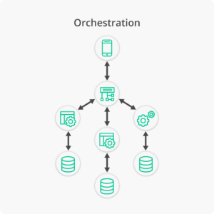
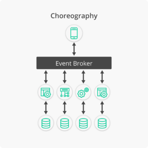

+++
title = "[译] 微服务协调与编排：协调的好处"

date = 2020-04-01
lastmod = 2020-04-01
draft = false

tags = ["Istio"]
summary = "有两种方法可以让微服务朝着一个共同的目标协同工作：协调（Choreography）和编排（Orchestration）。编排需要主动控制所有的元素和交互，就像指挥家指挥乐团的乐手一样，而协调则需要建立一个模式或例程，微服务会跟随音乐起舞，不需要监督和指令。"
abstract = "有两种方法可以让微服务朝着一个共同的目标协同工作：协调（Choreography）和编排（Orchestration）。编排需要主动控制所有的元素和交互，就像指挥家指挥乐团的乐手一样，而协调则需要建立一个模式或例程，微服务会跟随音乐起舞，不需要监督和指令。"

[header]
image = "headers/post/202004-microservices-choreography-vs-orchestration.jpg"
caption = ""

+++

英文原文来自 [Microservices Choreography vs Orchestration: The Benefits of Choreography](https://solace.com/blog/microservices-choreography-vs-orchestration/)，作者 [ Jonathan Schabowsky](https://solace.com/blog/author/jonathan-schabowsky/) 。 

------

> 翻译说明：在中文中 Orchestration 通常都翻译为“编排”，这个术语通常为开发人员所熟知，如服务编排，容器编排（k8s）。而 Choreography 的翻译是“编舞/舞蹈编排”，在舞蹈之外的语义中通常也翻译为“编排”。本文为了明确的和 Orchestration 区分开，刻意将 Choreography 翻译为“协调”。并在全文中显示标注协调（Choreography）和编排（Orchestration）以避免误解。

微服务架构（一种软件设计范式，将应用程序和业务用例分解成一组可组合的服务）为企业组织带来许多技术上的好处。首先，它们小巧、轻便且易于实现。其次，它们实现了可重用性，降低了开发或更改应用程序的成本，确保了资源的有效利用，并使应用程序易于按需扩展。在高层次上，有两种方法可以让微服务朝着一个共同的目标协同工作：协调（Choreography）和编排（Orchestration）。

编排（Orchestration）需要主动控制所有的元素和交互，就像指挥家指挥乐团的乐手一样，而协调（Choreography）则需要建立一个模式或例程，微服务会跟随音乐起舞，不需要监督和指令。

微服务的采用正在迅速增长，这是由 Dimensional Research 代表 LightStep 进行的 [一项最新研究](https://siliconangle.com/2018/05/02/new-study-shows-rapid-growth-microservices-adoption-among-enterprises/) 证明的。该研究发现，几乎所有接受调查的部署过微服务的高级研发利益相关者都希望微服务成为其默认的应用架构。

研究还指出，微服务的实现还有很多许多挑战 – 很多与微服务如何相互交互来实现业务成果有关。在微服务编舞与编排之间进行选择，将影响到服务在后台无缝运行的方式，以及您是成功构建出微服务架构，还是分布式单体。

## 编排如何杀死微服务并创建分布式单体

在乐团中，每个音乐家都在等待指挥家的指令。他们每个人都是演奏乐器的专家，无论是小提琴，低音鼓还是单簧管，他们都久经训练，并拥有活页乐谱 - 但他们还是会在没有指挥的情况下集体迷失。

在编排（Orchestration）中，服务控制器处理微服务之间的所有通信，并指导每个服务执行预期的功能。在我们的交响乐示例中，功能是“演奏音乐”。

### 微服务编排的缺点

[编排的一个缺点](https://www.youtube.com/watch?v=fvXkN5cFMFY&t=32s) 是控制器需要与每个服务直接通信并等待每个服务的响应。现在，这些交互是在网络上发生的，调用会花费更长的时间，并且会受到下游网络和服务可用性的影响。

在较小的环境中，这可能会工作很好，但是当有数百甚至数千个微服务时，事情就会分崩离析。您基本上已经创建了一个分布式的单体应用程序，它比过去的应用程序更慢，更脆弱！就像指挥家会失去有效管理大型乐团的能力一样，因为每个音乐家都在等待个别的关注，因此要求服务控制来管理这么多微服务是不可行的。

#### 紧耦合

当编排（Orchestration）微服务时，你会发现它们彼此高度依赖 - 当它们是同步的，每个服务都必须明确地接收和响应请求，才能使整个服务正常工作，任何一点故障都可能使整个服务停止运行。

当我们在企业环境中谈论微服务时，有时会有成千上万的微服务应用于单一业务功能。在这种规模下，一对一的交互根本跟不上业务需求。

#### 对RESTful API的依赖

编排（Orchestration）方法也依赖于RESTful API---通常是以紧密耦合的服务形式创建的，所以使用它们实际上会增加你的架构中的耦合度。此外，构建新功能的成本很高，对API的影响也很大。

那么，如果RESTful API和编排（Orchestration）架构不能扩展，那么部署和管理微服务的解决方案是什么样子的呢？答案将带我们走出编排的坑，走上人生巅峰......

## 使用事件流的协调服务的好处

如果说指挥交响乐是服务编排（Orchestration）的一个很好的比喻，那么舞蹈队就很适合协调（Choreography）。在一个舞蹈团队中，每个人都知道自己应该做什么，并且能够（并被要求）在每一个节拍打响时迈出正确的步伐。

要协调（Choreography）微服务，你需要一种信息交换的方式：在微服务之间每当有事情发生时，就需要在微服务之间交换消息--你需要 [事件代理](https://solace.com/what-is-an-event-broker/)。当给定的微服务发送消息的那一刻，它们就完成了。其他的事情都是以异步的方式发生，不需要等待响应，也不用担心下一步会发生什么。每个服务都在观察它的环境，任何其他订阅了那个消息通道的服务都会从那里知道要做什么。

在我们的类比中，舞者(微服务)听着音乐(事件代理)，并做出必要的动作，因为他们都在遵循同样的协调（Choreography）。

### 服务松耦合，实现敏捷和容错

在协调（Choreography）好的微服务架构中，添加和删除服务要简单得多。你需要做的就是将微服务连接（或将其断开）到事件代理中的适当通道（channel）。通过服务松耦合，微服务的添加和删除不会破坏现有的逻辑，从而减少了开发造成的问题。

协调（Choreography）微服务的事实意味着，如果一个应用出现故障，不依赖它的业务服务可以在问题得到纠正的同时继续进行。同时也不需要每个服务在网络故障时都有复杂的、内置的错误处理，因为这是事件代理的责任。

使用 RESTful API，错误会导致级联问题。这可能会导致原本可以执行的任务因为单一的通信问题而被阻断，从而导致资源闲置。此外，任何中断都会导致客户失望，并有可能导致业务损失。

### 更快更敏捷的开发

在这个快节奏的环境中，产品上市的时间至关重要，开发和修改应用程序的速度会对业务产生严重影响。开发团队敏捷性的一个常见障碍是容易受到其他服务变化的影响。协调（Choreography）好的、事件驱动的微服务允许开发团队更独立地运作，专注于关键服务。一旦这些服务被创建出来后，它们就可以很容易在团队之间共享。这种对已开发组件的重用，可以大大节省人力和时间。

### 更加一致而高效的应用

当创建具有特定功能的微服务时，你可以创建一个更模块化的代码库。每个微服务处理一个特定的业务功能，作为一个单元，它们一起执行业务流程。

重用这些微服务作为众多业务流程的一部分，这样的能力可以使你的系统保持一致，并使创建或修改服务更容易，因为你可以利用已经被证明可以执行特定功能的代码。

## 让微服务起舞

只使用 RESTful API 方式的时代已经过去了-- 对于能够更快、更可靠地提供业务服务，并且能够轻松扩展的架构来说，更好的方法是协调（Choreography）微服务之间的交互。随着事件驱动的架构和微服务席卷了软件开发领域，服务之间的交互方式将为公司节省时间和金钱，同时改善客户体验。

